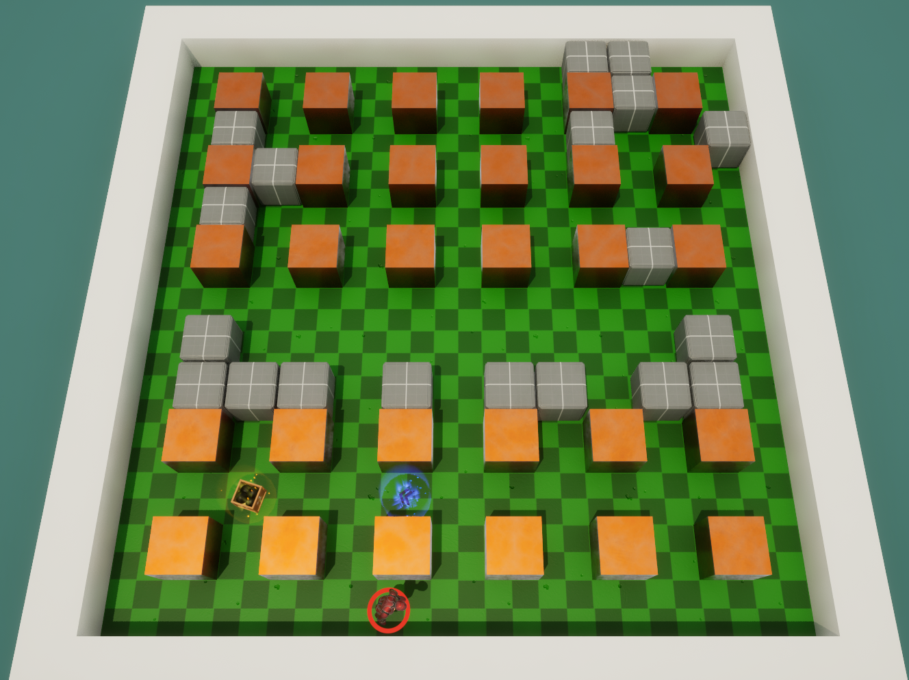
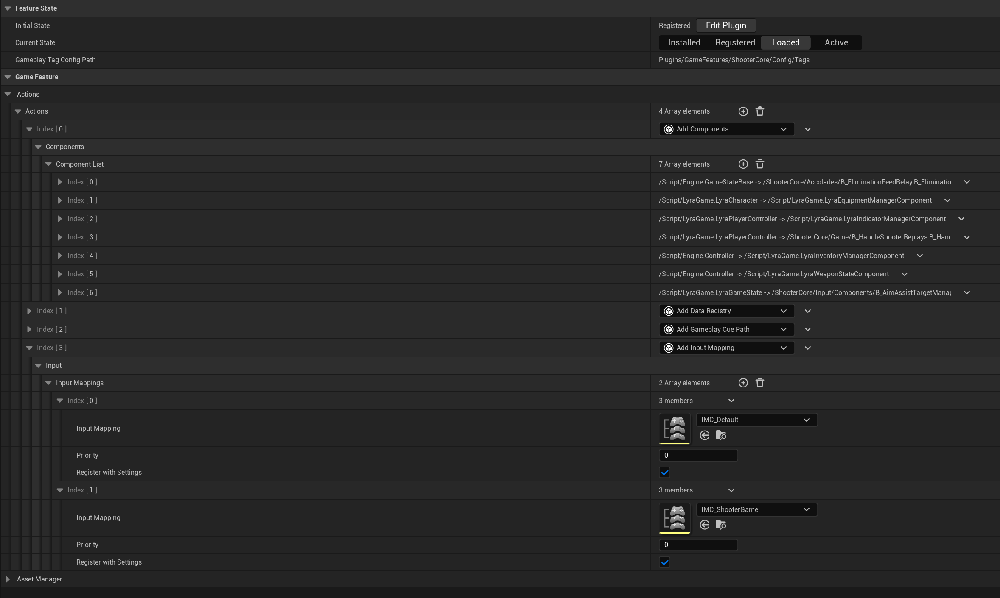
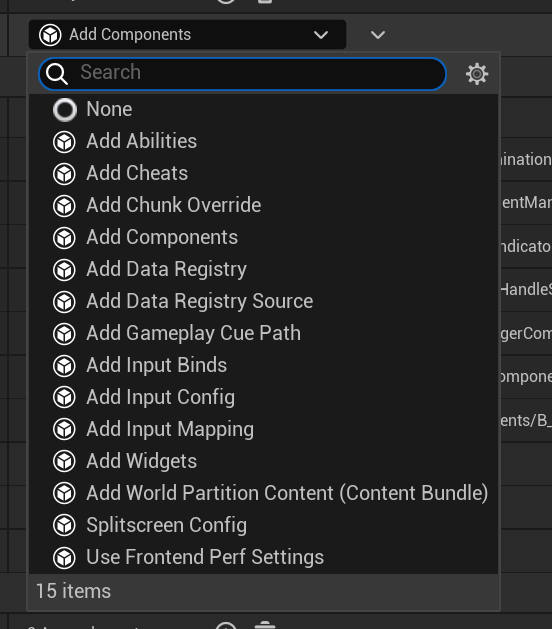
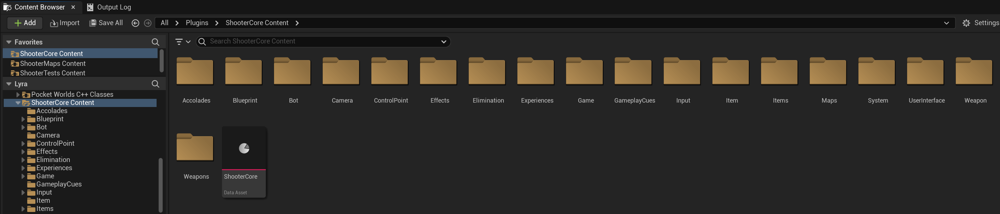
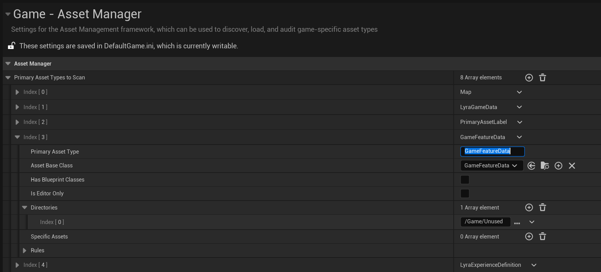
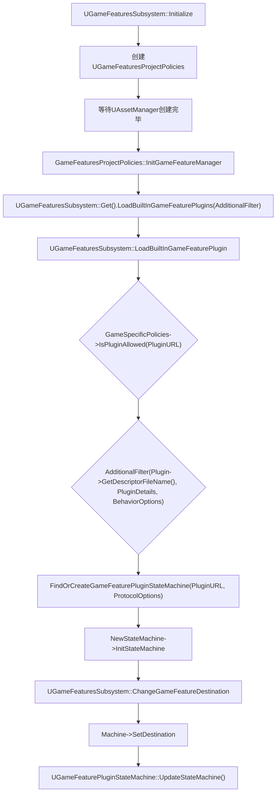
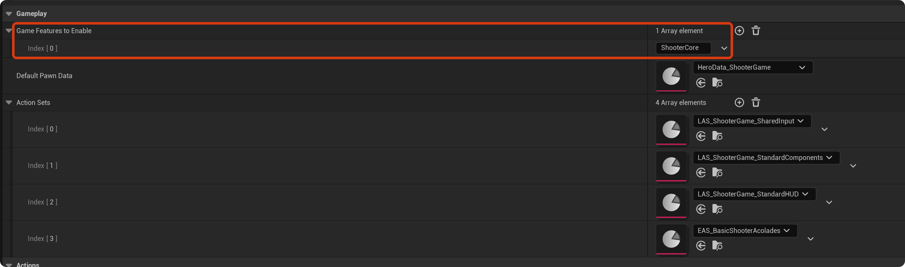

# GameFeatures框架

## 介绍

> UE官方文档对GameFeatures的介绍，原文如下：
> 游戏功能（Game Features） 和 模块化Gameplay（Modular Gameplay） 插件可以帮助开发人员为项目创建独立功能。使用插件来构建功能有多种优势：
>
> - 保持你的项目代码库的清洁且可读。
> - 避免不相关的功能之间意外交互或依赖。在开发那些需要经常改动功能的已上线产品时，这尤为重要。

看完似乎让人不明所以，所以让我们结合UE5的Lyra示例，简要介绍一下GameFeatures框架。
在Lyra示例中，存在着多种游戏模式，其中有两种差别极大的游戏模式，分别是FPS射击模式和类似于炸弹人的游戏模式。



这两种游戏模式玩法完全不同，玩家操作的角色在不同的模式中也有着完全不同的行为和属性。为了隔离解耦多个游戏模式，此时便轮到GameFeatures框架登场了。GameFeature其实就是一种比较特殊的插件，这些插件共同组成了游戏的整体玩法。我们可以选择将一个玩法封装成一个插件，在运行时根据用户选择的游戏模式动态的开关这个插件，从而改变游戏的玩法，因此GameFeatures框架可以用来实现模块化Gameplay与热插拔功能。

所以在我们使用GameFeatures框架时，也就隐含了一些设计原则，如果我们基础公共逻辑是Core模块，而GameFeatures框架中的插件是实现玩法的模块，那么依赖关系只能是GameFeatures依赖于Core模块，这是与UE的传统插件最大的不同。同时虽然GameFeatures框架中的插件可以相互依赖，但是为了保证GameFeatures框架实现玩法的独立性与热插拔机制，我们应当尽量避免循环依赖。

## 模块化配置组织方式

同样以Lyra为例，快速了解一下GameFeatures框架在示例项目中的用法。Lyra的初始场景中只包含一个简单的模式选择地图，选择对应的地图后会进入对应的游戏模式，进入每个模式必然需要给玩家角色扩展各种各样的能力，因此我们需要有一套配置资产来描述需要扩展的内容，这便是GameFeatureData的作用。GameFeatureData资产中可以直接控制玩法插件的初始状态和当前状态，目前能看到有四种状态，这也是控制玩法热插拔的核心概念，后面会详细介绍。


GameFeatureData资产中另一个重要的概念便是基于Action的功能扩展方式，例如在不同的游戏模式下，可能需要不用的输入操作，因此提供了Add Input Mapping Action；不同模式下可能需要扩展各种组件，因此提供了Add Components Action等，可以说GameFeatureAction正是能实现游戏模式扩展的核心。


上述说的这些资产，正是存放在GameFeature插件中，例如Lyra射击模式的GameFeature插件`ShooterCore`中包含的资产如下图：


此时使用GameFeatures框架所需要接触的概念便已经全部介绍完毕，简单总结一下：

- GameFeature，UE插件，用于实现玩法存放各种所需资产
- GameFeatureData，纯数据配置资产，用于描述GameFeature插件需要扩展的动作
- GameFeatureAction，描述并执行扩展所需要执行的动作，例如Add Input Mapping Action、Add Components Action等

## 初始化流程

前面简单介绍了GameFeatures中的一些概念，下面进入具体的实现。

### 核心管理者

任何框架都少不了初始化，既然要初始化就要有一个统领全局的类，GameFeatures框架的核心管理者便是`UGameFeaturesSubsystem`，它继承自`UEngineSubsystem`，因此比较特殊的一点是它会跟随着引擎编辑器启动，所以在编辑器模式下即使停止PIE，已经加载或激活的GF插件也依然是保持原本状态的。

初始化最先运行的逻辑如下：

```cpp
void UGameFeaturesSubsystem::Initialize(FSubsystemCollectionBase& Collection)
{
    // 可以根据需求自定义所需的GameFeaturesProjectPolicies
	const FSoftClassPath& PolicyClassPath = GetDefault<UGameFeaturesSubsystemSettings>()->GameFeaturesManagerClassName;

	UClass* SingletonClass = nullptr;
	if (!PolicyClassPath.IsNull())
	{
		SingletonClass = LoadClass<UGameFeaturesProjectPolicies>(nullptr, *PolicyClassPath.ToString());
	}

	if (SingletonClass == nullptr)
	{
		SingletonClass = UDefaultGameFeaturesProjectPolicies::StaticClass();
	}

	GameSpecificPolicies = NewObject<UGameFeaturesProjectPolicies>(this, SingletonClass);
	check(GameSpecificPolicies);
    // GF的实现是资产驱动的，因此需要等待资产管理器的创建完毕
	UAssetManager::CallOrRegister_OnAssetManagerCreated(FSimpleMulticastDelegate::FDelegate::CreateUObject(this, &ThisClass::OnAssetManagerCreated));
    // GF包含一些命令行，让开发者可以快速调试
	IConsoleManager::Get().RegisterConsoleCommand(
		TEXT("ListGameFeaturePlugins"),
		TEXT("Prints game features plugins and their current state to log. (options: [-activeonly] [-csv])"),
		FConsoleCommandWithWorldArgsAndOutputDeviceDelegate::CreateUObject(this, &ThisClass::ListGameFeaturePlugins),
		ECVF_Default);
    ......
}
```

### 加载策略管理器

前面的逻辑可以看到UE提供了一个默认的Policy管理器，即`UDefaultGameFeaturesProjectPolicies`，它默认会加载所有的GF插件，开发者也可以自定义自己的Policy管理器，其中比较重要的接口如下：

```cpp
UCLASS()
class GAMEFEATURES_API UGameFeaturesProjectPolicies : public UObject
{
	// Called when the game feature manager is initialized
	virtual void InitGameFeatureManager() { }

	// Called when the game feature manager is shut down
	virtual void ShutdownGameFeatureManager() { }

	// Called to determine if this should be treated as a client, server, or both for data preloading
	// Actions can use this to decide what to load at runtime
	virtual void GetGameFeatureLoadingMode(bool& bLoadClientData, bool& bLoadServerData) const { bLoadClientData = true; bLoadServerData = true; }

	// Called to determine if a plugin is allowed to be loaded or not
	// (e.g., when doing a fast cook a game might want to disable some or all game feature plugins)
	virtual bool IsPluginAllowed(const FString& PluginURL) const { return true; }
};
```

### 加载GF插件

前面提到GF的加载需要等待资产管理器的创建完毕，原因是需要将GameFeatureData配置为PrimaryAsset以便资产管理器进行扫描，切记切记，配置图如下：


后续的逻辑入口便是`OnAssetManagerCreated`函数，然后会调用Policy的`InitGameFeatureManager`函数。加载插件的逻辑总入口在`LoadBuiltInGameFeaturePlugins`函数中。

```cpp
void UDefaultGameFeaturesProjectPolicies::InitGameFeatureManager()
{
	UE_LOG(LogGameFeatures, Log, TEXT("Scanning for built-in game feature plugins"));

    // 开发者可以自定义自己的过滤器，决定是否加载某个GF插件
	auto AdditionalFilter = [&](const FString& PluginFilename, const FGameFeaturePluginDetails& PluginDetails, FBuiltInGameFeaturePluginBehaviorOptions& OutOptions) -> bool
	{
		// By default, force all initially loaded plugins to synchronously load, this overrides the behavior of GameFeaturePlugin.AsyncLoad which will be used for later loads
		OutOptions.bForceSyncLoading = true;

		// By default, no plugins are filtered so we expect all built-in dependencies to be created before their parent GFPs
		OutOptions.bLogWarningOnForcedDependencyCreation = true;

		return true;
	};

	UGameFeaturesSubsystem::Get().LoadBuiltInGameFeaturePlugins(AdditionalFilter);
}

void UGameFeaturesSubsystem::LoadBuiltInGameFeaturePlugins(FBuiltInPluginAdditionalFilters AdditionalFilter, const FBuiltInGameFeaturePluginsLoaded& InCompleteDelegate /*= FBuiltInGameFeaturePluginsLoaded()*/)
{
	FBuiltInPluginLoadTimeTracker PluginLoadTimeTracker;
    // 从插件管理器中获取所有启用的插件
	TArray<TSharedRef<IPlugin>> EnabledPlugins = IPluginManager::Get().GetEnabledPlugins();

	// 按照插件依赖关系对插件进行排序加载
	TArray<TSharedRef<IPlugin>> Dependencies;
	auto GetPluginDependencies =
		[&Dependencies](TSharedRef<IPlugin> CurrentPlugin)
	{
		IPluginManager& PluginManager = IPluginManager::Get();
		Dependencies.Reset();
		
		const FPluginDescriptor& Desc = CurrentPlugin->GetDescriptor();
		for (const FPluginReferenceDescriptor& Dependency : Desc.Plugins)
		{
			if (Dependency.bEnabled)
			{
				if (TSharedPtr<IPlugin> FoundPlugin = PluginManager.FindEnabledPlugin(Dependency.Name))
				{
					Dependencies.Add(FoundPlugin.ToSharedRef());
				}
			}
		}
		return Dependencies;
	};
	Algo::TopologicalSort(EnabledPlugins, GetPluginDependencies);

	for (const TSharedRef<IPlugin>& Plugin : EnabledPlugins)
	{
		FBuiltInPluginLoadTimeTrackerScope TrackerScope(PluginLoadTimeTracker, Plugin);
        // 开始尝试加载插件
		LoadBuiltInGameFeaturePlugin(Plugin, AdditionalFilter, FGameFeaturePluginLoadComplete::CreateLambda([LoadContext, Plugin](const UE::GameFeatures::FResult& Result)
		{
			LoadContext->Results.Add(Plugin->GetName(), Result);
			++LoadContext->NumPluginsLoaded;
			UE_LOG(LogGameFeatures, VeryVerbose, TEXT("Finished Loading %i builtins"), LoadContext->NumPluginsLoaded);
		}));
	}
}
```

上述代码的流程其实比较简单，核心逻辑就是获取所有启用的插件，然后按照依赖关系进行排序，最后依次尝试加载插件。加载插件的核心逻辑正是`LoadBuiltInGameFeaturePlugin`函数，来看一下它的实现：

```cpp
void UGameFeaturesSubsystem::LoadBuiltInGameFeaturePlugin(const TSharedRef<IPlugin>& Plugin, FBuiltInPluginAdditionalFilters AdditionalFilter, const FGameFeaturePluginLoadComplete& CompleteDelegate /*= FGameFeaturePluginLoadComplete()*/)
{
	FString PluginURL;
	FGameFeaturePluginDetails PluginDetails;
    // 此函数会调用IsValidGameFeaturePlugin判断插件是否有效，判断方式为路径匹配，路径必须匹配ProjectDir/Plugins/GameFeatures
	if (GetBuiltInGameFeaturePluginDetails(Plugin, PluginURL, PluginDetails))
	{
        // Policy自定义的过滤规则，默认为全部允许
		if (GameSpecificPolicies->IsPluginAllowed(PluginURL))
		{
			FBuiltInGameFeaturePluginBehaviorOptions BehaviorOptions;
			// 外层Policy函数中一路传递过来的自定义过滤器，参数更加丰富
			const bool bShouldProcess = AdditionalFilter(Plugin->GetDescriptorFileName(), PluginDetails, BehaviorOptions);
			if (bShouldProcess)
			{
				FGameFeatureProtocolOptions ProtocolOptions;
				ProtocolOptions.bForceSyncLoading = BehaviorOptions.bForceSyncLoading;
				ProtocolOptions.bLogWarningOnForcedDependencyCreation = BehaviorOptions.bLogWarningOnForcedDependencyCreation;
				ProtocolOptions.bLogErrorOnForcedDependencyCreation = BehaviorOptions.bLogErrorOnForcedDependencyCreation;
                // 创建StateMachine
				UGameFeaturePluginStateMachine* StateMachine = FindOrCreateGameFeaturePluginStateMachine(PluginURL, ProtocolOptions);
                // 根据插件配置的BuiltInInitialFeatureState设置初始化目标状态
				EBuiltInAutoState InitialAutoState = (BehaviorOptions.AutoStateOverride != EBuiltInAutoState::Invalid) ? 
					BehaviorOptions.AutoStateOverride : PluginDetails.BuiltInAutoState;
				const EGameFeaturePluginState DestinationState = ConvertInitialFeatureStateToTargetState(InitialAutoState);

				StateMachine->SetWasLoadedAsBuiltIn();

				// If we're already at the destination or beyond, don't transition back
				FGameFeaturePluginStateRange Destination(DestinationState, EGameFeaturePluginState::Active);
				// 开始尝试状态切换逻辑
				ChangeGameFeatureDestination(StateMachine, ProtocolOptions, Destination,
					FGameFeaturePluginChangeStateComplete::CreateWeakLambda(this, [this, StateMachine, Destination, CompleteDelegate](const UE::GameFeatures::FResult& Result)
					{
						LoadBuiltInGameFeaturePluginComplete(Result, StateMachine, Destination);
						CompleteDelegate.ExecuteIfBound(Result);
					}));
			}
    ......
}
```

加载逻辑中首先进行了两次过滤，第一次过滤主要是匹配路径，匹配成功后会解析插件的uplugin配置文件，配置中比较重要的一个字段是`BuiltInInitialFeatureState`，两次过滤满足条件之后会为插件创建一个状态机`UGameFeaturePluginStateMachine`，然后根据`BuiltInInitialFeatureState`的值设置状态机的目标初始状态。

### 状态机

GF插件状态机是GF能够实现状态流转从而热插拔的核心，从之前的资产文件我们发现状态机看起来很简单只有四个状态，分别是`Installed`、`Registered`、`Loaded`和`Active`，但是其实GF的状态流转相当复杂，共有34个状态，感谢UE的注释帮我省掉了画图的工作，让我们先来简单过目一下：

```cpp
/*
下图中的状态虽多，但是可以被分为三种类型：
目标状态，用 * 标记，这些状态是外部逻辑可以通过 SetDestinationState() 函数请求转换的状态类型
错误状态，用 ! 标记，如果在状态转换期间发生错误，这些状态将成为目标状态
过渡状态，无标记，这种状态比较特殊，状态机无法停留在过渡状态，而是应该在完成需要的工作后转换为另一种状态

                         +--------------+
                         |              |
                         |Uninitialized |
                         |              |
                         +------+-------+
     +------------+             |
     |     *      |             |
     |  Terminal  <-------------~-----------------------------------------------
     |            |             |                                              |
     +--^------^--+             ----------------------------                   |
        |      |                                           |                   |
        |      |                                    +------v--------+          |
        |      |                                    |      *        |          |
        |      -------------------------------------+ UnknownStatus |          |
        |           ^                      ^        |               |          |
        |           |                      |        +-------+-------+          |
        |           |                      |                |                  |
        |    +------+-------+              |                |                  |
        |    |      *       |              |                |                  |
        |    | Uninstalled  +--------------~--------------->|                  |
        |    |              |              |                |                  |
        |    +------^-------+              |                |                  |
        |           |                      |                |                  |
        |    +------+-------+    *---------+---------+      |                  |
        |    |              |    |         !         |      |                  |
        |    | Uninstalling <----> ErrorUninstalling |      |                  |
        |    |              |    |                   |      |                  |
        |    +---^----------+    +---------+---------+      |                  |
        |        |                         |                |                  |
        |        |    ----------------------                |                  |
        |        |    |                                     |                  |
        |        |    |                     -----------------                  |
        |        |    |                     |                                  |
        |        |    |         +-----------v---+     +--------------------+   |
        |        |    |         |               |     |         !          |   |
        |        |    |         |CheckingStatus <-----> ErrorCheckingStatus+-->|
        |        |    |         |               |     |                    |   |
        |        |    |         +------+------^-+     +--------------------+   |
        |        |    |                |      |                                |
        |        |    |                |      |       +--------------------+   |
        ---------~    |                |      |       |         !          |   |
                 |    |<----------------      --------> ErrorUnavailable   +----
                 |    |                               |                    |
                 |    |                               +--------------------+
                 |    |
            +----+----v----+                            
            |      *       |
         ---> StatusKnown  +----------------------------------------------
         |  |              |                                 |           |
         |  +----------^---+                                 |           |
         |                                                   |           |
         |                                                   |           |
         |                                                   |           |
         |                                                   |           |
         |                                                   |           |
      +--+---------+      +-------------------+       +------v-------+   |
      |            |      |         !         |       |              |   |
      | Releasing  <------> ErrorManagingData <-------> Downloading  |   |
      |            |      |                   |       |              |   |
      +--^---------+      +-------------------+       +-------+------+   |
         |                                                   |           |
         |                                                   |           |
         |     +-------------+                               |           |
         |     |      *      |                               v           |
         ------+ Installed   <--------------------------------------------
               |             |
               +-^---------+-+
                 |         |
		   ------~---------~--------------------------------
           |     |         |                               |
        +--v-----+--+    +-v---------+               +-----v--------------+
        |           |    |           |				 |         !          |
        |Unmounting |    | Mounting  <---------------> ErrorMounting      |
        |           |    |           |				 |                    |
        +--^-----^--+    +--+--------+				 +--------------------+
           |     |          |
           ------~----------~-------------------------------
                 |          |                              |
                 |       +--v------------------- +   +-----v-----------------------+
                 |       |                       |	 |         !                   |
                 |       |WaitingForDependencies <---> ErrorWaitingForDependencies |
                 |       |                       |	 |                             |
                 |       +--+------------------- +	 +-----------------------------+
                 |          |
           ------~----------~-------------------------------
           |     |          |                              |
        +--v-----+----+  +--v-------- +              +-----v--------------+
        |             |  |            |				 |         !          |
        |Unregistering|  |Registering <--------------> ErrorRegistering   |
        |             |  |            |				 |                    |
        +--------^----+  ++---------- +				 +--------------------+
                 |        |
               +-+--------v-+
               |      *     |
               | Registered |
               |            |
               +-^--------+-+
                 |        |
           ------~--------~---------------------------------------
           |     |        |                               ^      |
        +--v-----+--+  +--v--------+                      |    +-+------------+
        |           |  |           |                      |    |      !       |
        | Unloading |  |  Loading  <-------------------- ~----> ErrorLoading  |
        |           |  |           |                      |    |              |
        +--------^--+  +--+--------+                      |    +--------------+
                 |        |                               |
               +-+--------v-+                             |
               |      *     |                             |
               |   Loaded   |                             |
               |            |                             |
               +-^--------+-+                             |
		         |        |                               |
        +--------+---+  +-v------------------------+   +--+--------------------------+
        |            |  |                          |   |             !               |
        |Deactivating|  |  ActivatingDependencies  <---> ErrorActivatingDependencies |
        |            |  |                          |   |                             |
        +-^----------+  +---------------------+----+   +-----------------------------+
          |                                   |
		  |  +-----------------------------+  |
		  |  |              !              |  |
		  |  |ErrorDeactivatingDependencies|  |
		  |  |                             |  |
		  |  +--^--------------------------+  |
		  |     |                             |
		+-+-----v----------------+          +-v----------+
		|		                 |          |            |
		|DeactivatingDependencies|          | Activating |
		|	   	                 |          |            |
		+----------------------^-+          +---+--------+
		                       |                |
		     	             +-+----------------v-+
                             |          *         |
                             |       Active       |
                             |                    |
                             +--------------------+
*/
```

上述状态流转图虽然复杂，但是我们可以先从一个GF插件正常激活时所需要经过的状态入手：
`Uninitialized`->`UnknownStatus`->`CheckingStatus`->`StatusKnown`->`Installed`->`Mounting`->`WaitingForDependencies`->`Registering`->`Registered`->`Loading`->`Loaded`->`ActivatingDependencies`->`Activating`->`Active`

#### 创建状态机

回顾前面的代码，状态机创建的入口是`FindOrCreateGameFeaturePluginStateMachine`，其中用了一个Map来保存所有已经创建的状态机。状态机创建完成之后需要经历一系列初始化逻辑。

```cpp
UGameFeaturePluginStateMachine* UGameFeaturesSubsystem::FindOrCreateGameFeaturePluginStateMachine(const FString& PluginURL, const FGameFeatureProtocolOptions& ProtocolOptions, bool* bOutFoundExisting /*= nullptr*/)
{
	FGameFeaturePluginIdentifier PluginIdentifier(PluginURL);
	TObjectPtr<UGameFeaturePluginStateMachine> const* ExistingStateMachine =
		GameFeaturePluginStateMachines.FindByHash(GetTypeHash(PluginIdentifier.GetIdentifyingString()), PluginIdentifier.GetIdentifyingString());

	if (ExistingStateMachine)
	{
		return *ExistingStateMachine;
	}

	UGameFeaturePluginStateMachine* NewStateMachine = NewObject<UGameFeaturePluginStateMachine>(this);
    // 记录新创建的状态机
	GameFeaturePluginStateMachines.Add(FString(PluginIdentifier.GetIdentifyingString()), NewStateMachine);
	NewStateMachine->InitStateMachine(MoveTemp(PluginIdentifier), ProtocolOptions);

	return NewStateMachine;
}

void UGameFeaturePluginStateMachine::InitStateMachine(FGameFeaturePluginIdentifier InPluginIdentifier, const FGameFeatureProtocolOptions& InProtocolOptions)
{
    // 可以看到新创建的状态机初始状态为Uninitialized
	check(GetCurrentState() == EGameFeaturePluginState::Uninitialized);
    // 立刻进入UnknownStatus状态
	CurrentStateInfo.State = EGameFeaturePluginState::UnknownStatus;
	StateProperties = FGameFeaturePluginStateMachineProperties(
		MoveTemp(InPluginIdentifier),
		FGameFeaturePluginStateRange(CurrentStateInfo.State),
		FGameFeaturePluginRequestUpdateStateMachine::CreateUObject(this, &ThisClass::UpdateStateMachine),
		FGameFeatureStateProgressUpdate::CreateUObject(this, &ThisClass::UpdateCurrentStateProgress));

	StateProperties.ProtocolOptions = InProtocolOptions;

#define GAME_FEATURE_PLUGIN_STATE_MAKE_STATE(inEnum, inText) AllStates[EGameFeaturePluginState::inEnum] = MakeUnique<FGameFeaturePluginState_##inEnum>(StateProperties);
    // 此处的宏作用是对所有状态执行GAME_FEATURE_PLUGIN_STATE_MAKE_STATE操作，因此最终效果是为所有状态创建了对应的FGameFeaturePluginState_##inEnum的实例
	GAME_FEATURE_PLUGIN_STATE_LIST(GAME_FEATURE_PLUGIN_STATE_MAKE_STATE)
#undef GAME_FEATURE_PLUGIN_STATE_MAKE_STATE
	// UnknownStatus状态调用BeginState函数
	AllStates[CurrentStateInfo.State]->BeginState();
}
```

#### 状态初始化

首先先来看一下状态基类中的关键函数接口，每个状态都继承自`FGameFeaturePluginState`，在状态开始时调用`BeginState`，在状态运行时调用`UpdateState`来判断是否应该进行状态切换，在状态结束时调用`EndState`来进行清理工作。`GetStateType`可以判断状态类型为前面说到的三种之一。

```cpp
struct FGameFeaturePluginState
{
	FGameFeaturePluginState(FGameFeaturePluginStateMachineProperties& InStateProperties) : StateProperties(InStateProperties) {}
	virtual ~FGameFeaturePluginState();

	/** Called when this state becomes the active state */
	virtual void BeginState() {}

	/** Process the state's logic to decide if there should be a state transition. */
	virtual void UpdateState(FGameFeaturePluginStateStatus& StateStatus) {}

	/** Attempt to cancel any pending state transition. */
	virtual void TryCancelState() {}
	
	/** Called when this state is no longer the active state */
	virtual void EndState() {}

	/** Returns the type of state this is */
	virtual EGameFeaturePluginStateType GetStateType() const { return EGameFeaturePluginStateType::Transition; }

	FDestinationGameFeaturePluginState* AsDestinationState();
	FErrorGameFeaturePluginState* AsErrorState();
}
```

回顾前面加载GF插件的函数`LoadBuiltInGameFeaturePlugin`中，需要根据插件配置的BuiltInInitialFeatureState设置初始化后的目标状态。
后续步骤首先构建了`FGameFeaturePluginStateRange`的变量后调用了`ChangeGameFeatureDestination`函数。`StateRange`变量特殊的地方在于其内部存储的并不是一个单一目标状态，而是一个状态范围`MinState <= MaxState`，因此判断状态机状态切换完成的方式是判断当前状态是否在目标状态范围之内。

```cpp
void UGameFeaturesSubsystem::ChangeGameFeatureDestination(UGameFeaturePluginStateMachine* Machine, const FGameFeatureProtocolOptions& InProtocolOptions, const FGameFeaturePluginStateRange& StateRange, FGameFeaturePluginChangeStateComplete CompleteDelegate)
{
	const bool bSetDestination = Machine->SetDestination(StateRange,
		FGameFeatureStateTransitionComplete::CreateUObject(this, &ThisClass::ChangeGameFeatureTargetStateComplete, CompleteDelegate));

	......
}

bool UGameFeaturePluginStateMachine::SetDestination(FGameFeaturePluginStateRange InDestination, FGameFeatureStateTransitionComplete OnFeatureStateTransitionComplete, FDelegateHandle* OutCallbackHandle /*= nullptr*/)
{
	if (CurrentStateInfo.State == EGameFeaturePluginState::Terminal && !InDestination.Contains(EGameFeaturePluginState::Terminal))
	{
		// Can't tranistion away from terminal state
		return false;
	}

    // 此处需要区分状态机目前是否在状态切换运行中，未在运行时新目标范围都是合法的
	if (!IsRunning())
	{
		FDestinationGameFeaturePluginState* CurrState = AllStates[CurrentStateInfo.State]->AsDestinationState();
		// 如果当前状态在目标状态范围内，直接执行完成切换的回调
		if (InDestination.Contains(CurrentStateInfo.State))
		{
			OnFeatureStateTransitionComplete.ExecuteIfBound(this, MakeValue());
			return true;
		}
		// 根据当前状态获取要达成的目标状态，监听目标状态到达的回调
		if (CurrentStateInfo.State < InDestination)
		{
			FDestinationGameFeaturePluginState* MinDestState = AllStates[InDestination.MinState]->AsDestinationState();
			FDelegateHandle CallbackHandle = MinDestState->OnDestinationStateReached.Add(MoveTemp(OnFeatureStateTransitionComplete));
			if (OutCallbackHandle)
			{
				*OutCallbackHandle = CallbackHandle;
			}
		}
		else if (CurrentStateInfo.State > InDestination)
		{
			FDestinationGameFeaturePluginState* MaxDestState = AllStates[InDestination.MaxState]->AsDestinationState();
			FDelegateHandle CallbackHandle = MaxDestState->OnDestinationStateReached.Add(MoveTemp(OnFeatureStateTransitionComplete));
			if (OutCallbackHandle)
			{
				*OutCallbackHandle = CallbackHandle;
			}
		}
		// 更新状态机目标状态，并启动状态机更新流程
		StateProperties.Destination = InDestination;
		UpdateStateMachine();

		return true;
	}
	// 状态机正在切换运行中所以需要取新旧目标状态的交集来作为新目标状态
	if (TOptional<FGameFeaturePluginStateRange> NewDestination = StateProperties.Destination.Intersect(InDestination))
	{
		......
	}

	// The requested state range is completely outside the the current state range so reject the request
	return false;
}
```

前面的流程可以说都是准备工作，到这一步才会真正启动状态机的更新工作`UpdateStateMachine`，此函数的关键步骤我都进行了注释。

```cpp
void UGameFeaturePluginStateMachine::UpdateStateMachine()
{
	EGameFeaturePluginState CurrentState = GetCurrentState();
	
	bool bKeepProcessing = false;
	int32 NumTransitions = 0;
	const int32 MaxTransitions = 10000; // 最大循环次数
	do
	{
		bKeepProcessing = false;

		FGameFeaturePluginStateStatus StateStatus;
		{
			// 获取当前状态能够转移到的下一个状态
			AllStates[CurrentState]->UpdateState(StateStatus);
		}

		if (StateStatus.TransitionToState != EGameFeaturePluginState::Uninitialized)
		{
			{
				// 结束当前状态，执行清理工作
				AllStates[CurrentState]->EndState();
			}
			CurrentStateInfo = FGameFeaturePluginStateInfo(StateStatus.TransitionToState);
			CurrentState = StateStatus.TransitionToState;
			{
				// 开始新状态，执行初始化工作
				AllStates[CurrentState]->BeginState();
			}

			if (StateProperties.bTryCancel && AllStates[CurrentState]->GetStateType() != EGameFeaturePluginStateType::Transition)
			{
				// 此处会将GF状态机从GameFeaturePluginStateMachines中移除
				UGameFeaturesSubsystem::Get().BeginTermination(this);
			}
			else if (const bool bError = !StateStatus.TransitionResult.HasValue(); bError)
			{
				......
			}
			else
			{
				// 只要当前状态还是过渡状态，或者没有到达目标状态，就继续执行状态机更新
				bKeepProcessing = AllStates[CurrentState]->GetStateType() == EGameFeaturePluginStateType::Transition || !StateProperties.Destination.Contains(CurrentState);
				if (!bKeepProcessing)
				{
					// Make sure bInUpdateStateMachine is not set while processing callbacks if we are at our destination
					ScopeGuard.Reset();
				}
				// 执行OnDestinationStateReached回调函数
				DoCallback(StateStatus.TransitionResult, CurrentState);
			}

			if (CurrentState == EGameFeaturePluginState::Terminal)
			{
				// Now that callbacks are done this machine can be cleaned up
				UGameFeaturesSubsystem::Get().FinishTermination(this);
				MarkAsGarbage();
			}
		}
	} while (bKeepProcessing);
}
```

到这一步执行完为止，状态机已经根据uplugin的配置完成了初始化工作。上述流程并不算很复杂，但是UE对状态机的三种状态划分，以及状态流转的封装设计还是很值得学习的。

### 流程梳理

将前面的流程梳理一下，流程图如下：



## 重要状态介绍

由于状态比较多，所以就挑几个重要的状态来介绍一下，其他的可以参考源码。

### `Installed`

还记得我们在配置GF资产的时候，可配置的目标状态的第一个是`Installed`，虽然这个状态看起来要做很多事情，但是实际上状态的实现非常简单，只有状态转移的逻辑。
我们暂且不考虑需要经历`Downloading`的插件逻辑，对于本地已有的GF插件来说，前面一系列状态转移直到`Installed`状态执行完成，其实只是检查确保了本地GF插件存在而已。真正显式的触发插件管理器加载插件模块的是后续的`Mounting`阶段，此时才会加载dll，触发StartupModule。

```cpp
struct FGameFeaturePluginState_Installed : public FDestinationGameFeaturePluginState
{
	virtual void UpdateState(FGameFeaturePluginStateStatus& StateStatus) override
	{
		if (StateProperties.Destination > EGameFeaturePluginState::Installed)
		{
			StateStatus.SetTransition(EGameFeaturePluginState::Mounting);
		}
		else if (StateProperties.Destination < EGameFeaturePluginState::Installed)
		{
			StateStatus.SetTransition(EGameFeaturePluginState::Releasing);
		}
	}
};
```

### `Registering`与`Registered`

第二个比较重要的状态就是完成GF插件注册的`Registering`状态，回顾一下之前放在插件Content根目录下的与插件同名的GameFeatureData资产文件，这一步的关键就是要查找这个资产文件并加载到内存中。至于目标状态`Registered`，其逻辑也非常简单，只是实现了`UpdateState`函数来进行状态转移。

```cpp
struct FGameFeaturePluginState_Registering : public FGameFeaturePluginState
{
	virtual void BeginState() override
	{
		// 前面的一大堆逻辑就是在准备下面这两个GameFeatureDataPath
		// 以TopDownArena插件为例，这个变量值为/TopDownArena/GameFeatureData.GameFeatureData
		GameFeatureDataSearchPaths.Emplace(MoveTemp(PreferredGameFeatureDataPath));
		// 这个变量值为/TopDownArena/TopDownArena.TopDownArena
		GameFeatureDataSearchPaths.Emplace(MoveTemp(BackupGameFeatureDataPath));
		for (const FString& Path : GameFeatureDataSearchPaths)
		{
			if (FPackageName::DoesPackageExist(Path))
			{
				GameFeatureDataHandle = UGameFeaturesSubsystem::LoadGameFeatureData(Path);
				if (GameFeatureDataHandle)
				{
					GameFeatureDataHandle->WaitUntilComplete(0.0f, false);
					// 最终将资产加载后记录在StateProperties中
					StateProperties.GameFeatureData = Cast<UGameFeatureData>(GameFeatureDataHandle->GetLoadedAsset());
				}
			}

			if (StateProperties.GameFeatureData)
			{
				break;
			}
		}

		LoadGFDState = StateProperties.GameFeatureData ? ELoadGFDState::Success : ELoadGFDState::Failed;
	}
};
```

### `Loading`与`Loaded`

完成上一步的插件注册之后，下一步就是`Loading`状态预加载资产了，当然GF不会直接把插件里的所有资产全都加载，预加载的资产列表是由Policy根据插件的GameFeatureData配置来决定的，因此我们可以自定义决定要预加载哪些文件。至于`Loaded`目标状态的实现，仍然是只有状态转移的逻辑。

```cpp
struct FGameFeaturePluginState_Loading : public FGameFeaturePluginState
{
	/** Loads primary assets and bundles for the specified game feature */
	TSharedPtr<FStreamableHandle> LoadGameFeatureBundles(const UGameFeatureData* GameFeatureToLoad)
	{
		const UGameFeaturesProjectPolicies& Policy = UGameFeaturesSubsystem::Get().GetPolicy<UGameFeaturesProjectPolicies>();
		// 获取预加载的Asset列表
		TArray<FPrimaryAssetId> AssetIdsToLoad = Policy.GetPreloadAssetListForGameFeature(GameFeatureToLoad);

		FPrimaryAssetId GameFeatureAssetId = GameFeatureToLoad->GetPrimaryAssetId();
		if (GameFeatureAssetId.IsValid())
		{
			AssetIdsToLoad.Add(GameFeatureAssetId);
		}

		TSharedPtr<FStreamableHandle> RetHandle;
		if (AssetIdsToLoad.Num() > 0)
		{
			RetHandle = UAssetManager::Get().LoadPrimaryAssets(AssetIdsToLoad, Policy.GetPreloadBundleStateForGameFeature());
		}
		return RetHandle;
	}
};
```

### `Activating`与`Active`

进行到激活状态这一步，GF插件本身要做的事情就几乎没有了，主要是会为GameFeatureData资产中添加的Action类触发`OnGameFeatureActivating`函数，真正为玩法提供实现的正是各种不同类型的Action类，简单来看一下Action类的重要接口函数。

```cpp
class GAMEFEATURES_API UGameFeatureAction : public UObject
{
	/** Called when the object owning the action is registered for possible activation, this is called even if a feature never activates */
	virtual void OnGameFeatureRegistering() {}

	/** Called to unregister an action, it will not be activated again without being registered again */
	virtual void OnGameFeatureUnregistering() {}
	
	/** Called to indicate that a feature is being loaded for activation in the near future */
	virtual void OnGameFeatureLoading() {}

	/** Called to indicate that a feature is being unloaded */
	virtual void OnGameFeatureUnloading() {}

	/** Called when the feature is actually applied */
	virtual void OnGameFeatureActivating(FGameFeatureActivatingContext& Context);

	/** Called when game feature is deactivated, it may be activated again in the near future */
	virtual void OnGameFeatureDeactivating(FGameFeatureDeactivatingContext& Context) {}
}
```

## 动态切换游戏模式

前面的一系列工作可以说都是引擎帮我们做的准备工作，实际游戏中激活哪个GF插件仍然要由我们来动态控制，此处仍然是以Lyra为例，Lyra中对游戏模式的组织是资产数据驱动，当玩家选择了某个模式之后，会尝试加载一个类型为`ULyraExperienceDefinition`的配置资产，资产中配置了这个模式所需要开启的GF插件，同时还配置了玩家控制的Pawn数据等其他重要信息。


因此顺理成章的，GF插件的激活就是在ExperienceDefinition资产加载完成后，具体实现在`ULyraExperienceManagerComponent::OnExperienceLoadComplete`函数中。

```cpp
void ULyraExperienceManagerComponent::OnExperienceLoadComplete()
{
	// find the URLs for our GameFeaturePlugins - filtering out dupes and ones that don't have a valid mapping
	GameFeaturePluginURLs.Reset();

	auto CollectGameFeaturePluginURLs = [This=this](const UPrimaryDataAsset* Context, const TArray<FString>& FeaturePluginList)
	{
		for (const FString& PluginName : FeaturePluginList)
		{
			FString PluginURL;
			if (UGameFeaturesSubsystem::Get().GetPluginURLByName(PluginName, /*out*/ PluginURL))
			{
				This->GameFeaturePluginURLs.AddUnique(PluginURL);
			}
		}
	};
	// 收集当前Exp所需要开启的GF插件
	CollectGameFeaturePluginURLs(CurrentExperience, CurrentExperience->GameFeaturesToEnable);
	for (const TObjectPtr<ULyraExperienceActionSet>& ActionSet : CurrentExperience->ActionSets)
	{
		if (ActionSet != nullptr)
		{
			CollectGameFeaturePluginURLs(ActionSet, ActionSet->GameFeaturesToEnable);
		}
	}

	// Load and activate the features	
	NumGameFeaturePluginsLoading = GameFeaturePluginURLs.Num();
	if (NumGameFeaturePluginsLoading > 0)
	{
		LoadState = ELyraExperienceLoadState::LoadingGameFeatures;
		for (const FString& PluginURL : GameFeaturePluginURLs)
		{
			ULyraExperienceManager::NotifyOfPluginActivation(PluginURL);
			// 此处完成了GF插件的Load和激活
			UGameFeaturesSubsystem::Get().LoadAndActivateGameFeaturePlugin(PluginURL, FGameFeaturePluginLoadComplete::CreateUObject(this, &ThisClass::OnGameFeaturePluginLoadComplete));
		}
	}
}
```

按需手动激活插件的函数接口都封装在`UGameFeaturesSubsystem`类中，常用的部分接口如下：

```cpp
class GAMEFEATURES_API UGameFeaturesSubsystem : public UEngineSubsystem
{
	/** Loads a single game feature plugin. */
	void LoadGameFeaturePlugin(const FString& PluginURL, const FGameFeaturePluginLoadComplete& CompleteDelegate);

	/** Loads a single game feature plugin and activates it. */
	void LoadAndActivateGameFeaturePlugin(const FString& PluginURL, const FGameFeaturePluginLoadComplete& CompleteDelegate);

	/** Changes the target state of a game feature plugin */
	void ChangeGameFeatureTargetState(const FString& PluginURL, EGameFeatureTargetState TargetState, const FGameFeaturePluginChangeStateComplete& CompleteDelegate);

	/** Determines if a plugin is in the Active state.*/
	bool IsGameFeaturePluginActive(const FString& PluginURL, bool bCheckForActivating = false) const;

	/** Deactivates the specified plugin */
	void DeactivateGameFeaturePlugin(const FString& PluginURL);

	/** Unloads the specified game feature plugin. */
	void UnloadGameFeaturePlugin(const FString& PluginURL, bool bKeepRegistered = false);
}
```

`LoadAndActivateGameFeaturePlugin`函数的逻辑很简单，就是用Active状态作为`TargetState`参数调用`ChangeGameFeatureTargetState`函数。`ChangeGameFeatureTargetState`函数首先会做一系列插件是否允许激活的判断，然后再查找或创建对应的状态机，最后以对应的状态机对象为参数调用前面我们介绍过的`ChangeGameFeatureDestination`函数，此处就不再赘述了。

## 最佳实践

篇幅有限此处就不再展开了，毕竟UE官方的样例项目Lyra就是最好的最佳实践参考，当UE推出了更好的新特性时，Lyra也会及时跟进，所以还是很值得研究一下里面的各种实现方式的。

<link rel="stylesheet" type="text/css" href="css/auto-number-title.css" />