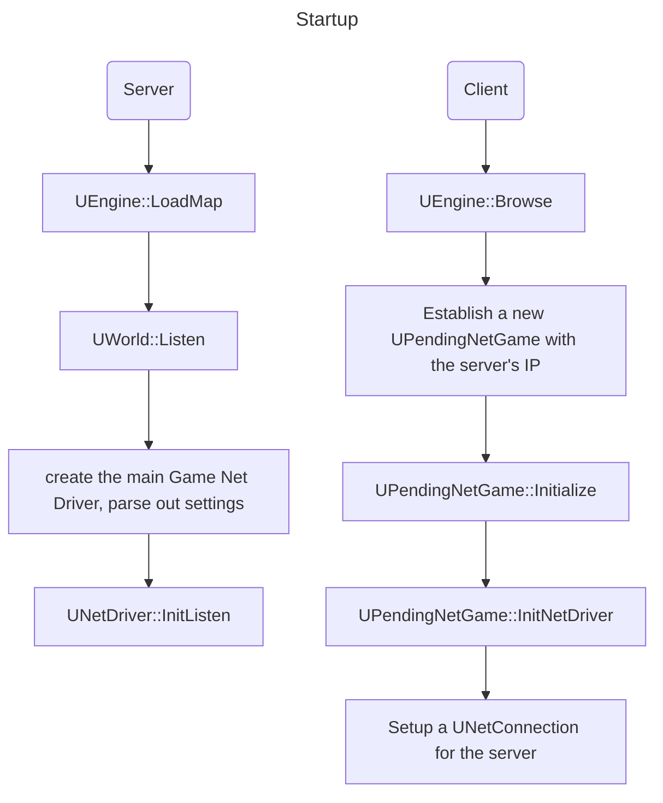
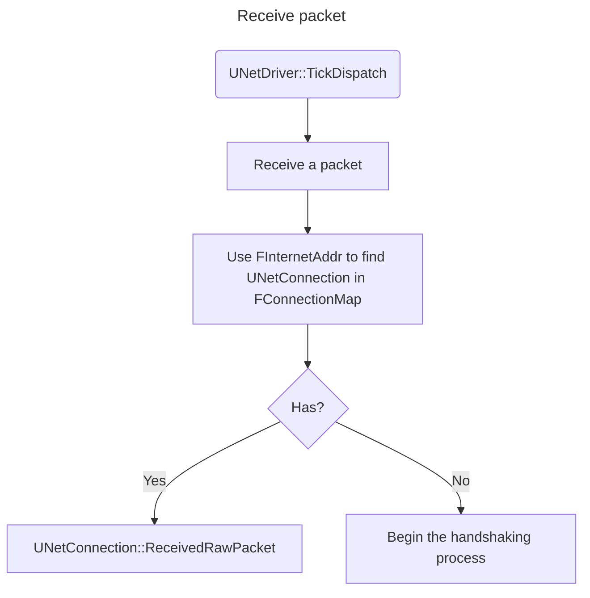
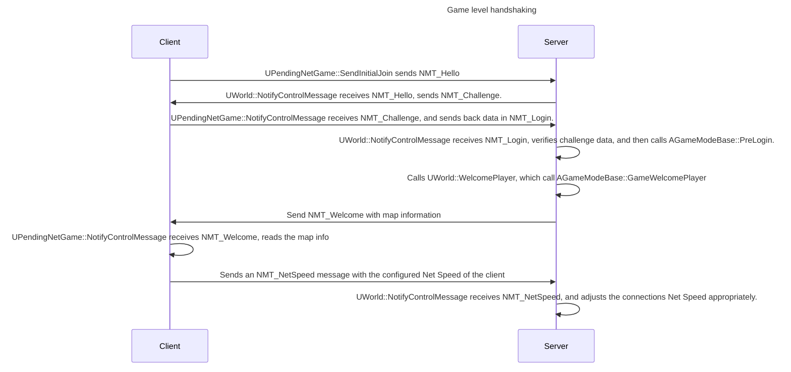
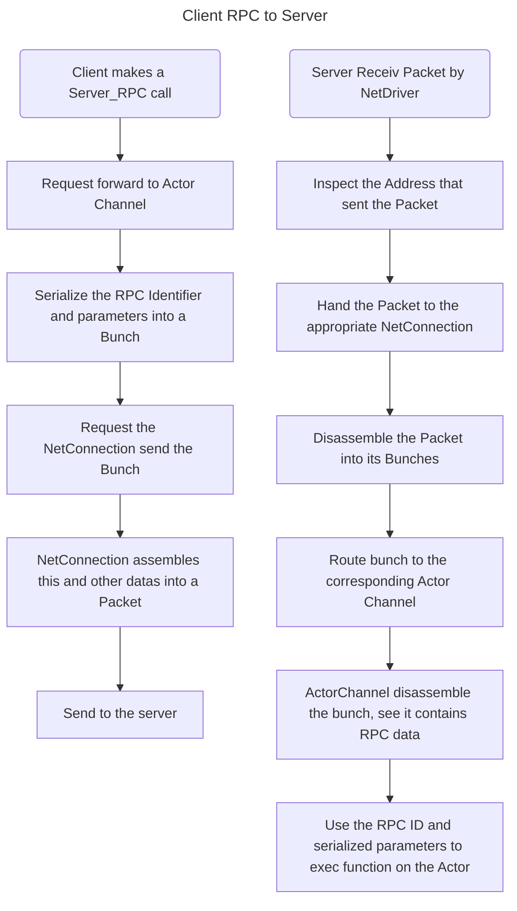
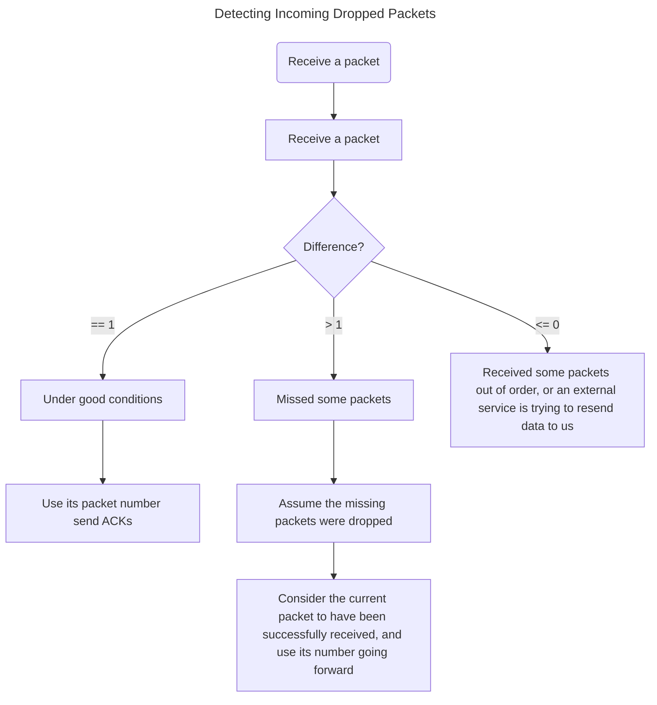

# UE 网络同步

## NetDrivers, NetConnections, and Channels

- UNetDrivers 负责管理 UNetConnections 以及可在它们之间共享的数据。
- NetConnections 代表连接到游戏（或更广泛地说，连接到 NetDriver）的单个客户端。
- 最终的数据不直接由 NetConnections 处理。相反，NetConnections 会将数据路由至 Channels。每个 NetConnection 都有自己的 Channels。
- 在正常情况下，只有一个 NetDriver（在客户端和服务器都会创建）用于"标准"游戏流量和连接。
- UIpNetDriver 和 UIpConnection（或派生类）是几乎所有平台的引擎默认使用的方式。
- 服务器和客户端都拥有自己的 NetDriver，UE 所有的游戏流量都将由 IpNetDriver 发送或接收。

## Startup and Handshaking

## UWorld / UPendingNetGame / AGameModeBase Startup and Handshaking

- 在 UNetDriver 和 UNetConnection 完成客户端和服务器的握手过程后，客户端将调用 UPendingNetGame::SendInitialJoin 启动游戏级的握手流程。
- 此握手流程是通过一套更有条理、更复杂的 FNetControlMessages 完成的。
  - 整套控制信息可在 DataChannel.h 中找到。
- 处理这些控制信息的大部分工作在 UWorld::NotifyControlMessage 和 UPendingNetGame::NotifyControlMessage 中完成。

- 此时，握手已经完成，玩家与游戏完全连接。根据加载地图所需的时间，在控制权转移到 UWorld 之前，客户端仍可能在 UPendingNetGame 上收到一些非握手控制信息。

## Reestablishing Lost Connections

- 如果是服务器主动断开连接，或者服务器意识到连接断开（由于超时或出错），那么将通过关闭 UNetConnection 并通知游戏来处理。
  - 此时，游戏将自行决定是否支持"游戏进行中加入"或"重新加入"。如果游戏支持，将完全重新启动上述握手流程。
- 如果只是短暂中断了客户端的连接，但服务器从未察觉，那么引擎/游戏通常会自动恢复（尽管会有一些数据包丢失/延迟）。
- 但是，如果客户端的 IP 地址或端口因任何原因发生变化，但服务器并未察觉，那么将通过重新进行low level handshake来开始恢复整个过程。在这种情况下，游戏代码不会收到提醒。
- 详细实现在 StatlessConnectionHandlerComponent.cpp 中。

## Data Transmission

- 游戏中的 NetConnections 和 NetDrivers 通常与所使用的底层通信方法/技术无关。这是由子类来决定的（如 UIpConnection / UIpNetDriver 或 UWebSocketConnection / UWebSocketNetDriver）。
  - 相反，UNetDriver 和 UNetConnection 使用 Packets 和 Bunches。
- Packets 是在主机和客户端上成对的 NetConnections 之间发送的数据块。Packets 由元数据（如报头信息和确认信息）和 Bunches 组成。
- Bunches 是在主机和客户端上成对的 Channels 之间发送的数据块。
  - 当一个连接收到一个 Packet 时，该 Packet 将被分解成单独的 Bunches。然后，这些 Bunches 会被传递到各个 Channels 进一步处理。
- 一个 Packet 可能不包含 Bunches、一个 Bunche 或多个 Bunches。
  - 由于 Bunches 的大小限制可能大于单个 Packet 的大小限制，UE 支持部分分组的概念。
  - 当 Bunche 过大时，会在传输前将其切成若干较小的 Bunches。这些 Bunches 将标记为 PartialInitial、Partial 或 PartialFinal。利用这些信息，我们可以在接收端重新组合 Bunches。

## Reliability and Retransmission

- When a NetConnection is established, it will establish a Sequence Number for its packets and bunches. These can either be fixed, or randomized (when randomized, the sequence will be sent by the server).
- The packet number is per NetConnection, incremented for every packet sent, every packet will include its packet number, and we will never retransmit a packet with the same packet number.
- The bunch number is per Channel, incremented for every **reliable** bunch sent, and every **reliable** bunch will include its bunch number. Unlike packets, though, exact (reliable) bunches may be retransmitted. This means we will resend bunches with the same bunch number.

### Detecting Incoming Dropped Packets

- By assigning packet numbers, we can easily detect when incoming packets are lost. This is done simply by taking the difference between the last successfully received packet number, and thepacket number of the current packet being processed.

- In either case, the engine will typically ignore the missing or invalid packets, and will not send ACKs for them.
- We do have methods for "fixing" out of order packets that are received on the same frame.
  - When enabled, if we detect missing packets (difference > 1), we won't process the current packet immediately.
  - Instead, it will add it to a queue. The next time we receive a packet successfully (difference == 1), we will see if the head of our queue is properly ordered. If so, we will process it, otherwise we will continue receiving packets.

### Detecting Outgoing Dropped Packets

- As mentioned above, whenever a packet is received successfully the recipient will send back an ACK. These ACKs will contain the packet numbers of successfully received packets, in sequence order.
- When ACKs are being processed, any ACK below our last received ACK is ignored and any gaps in packet numbers are considered Not Acknowledged (NAKed).
- It is the sender's responsibility to handle these ACKs and NAKs and resend any missing data.
  - The new data will be added to new outgoing packets (again, we will not resend packets we've already sent, or reuse packet sequence numbers).

### Resending Missing Data

- As mentioned above, packets alone don't contain useful game data. Instead, it's the bunches that comprise them that have meaningful data.
- Bunches can either be marked as Reliable or Unreliable.
  - The engine will make no attempt at resending unreliable bunches if they are dropped.
  - However, the engine will attempt to resend reliable bunches. Whenever a reliable bunch is sent, it will be added to a list of un-ACKed reliable bunches.
  - If we receive a NAK for a packet that contained the bunch, the engine will retransmit an exact copy of that bunch.
  - Note, because bunches may be partial, dropping even a single partial bunch will result in retransmission of the entire bunch. When all packets containing a bunch have been ACKed, we will remove it from the list.
- Similar to packets, we will compare the bunch number for received reliable bunches to the last successfully received bunch. If we detect that the difference is negative, we simply ignore the bunch.
  - If the difference is greater than one, we will assume we missed a bunch. Unlike packet handling, we will not discard this data.
  - Instead, we will queue the bunch and pause processing of **any** bunches, reliable or unreliable. Processing will not be resumed until we detect have received the missing bunches, at which point we will process them, and then start processing our queued bunches.
