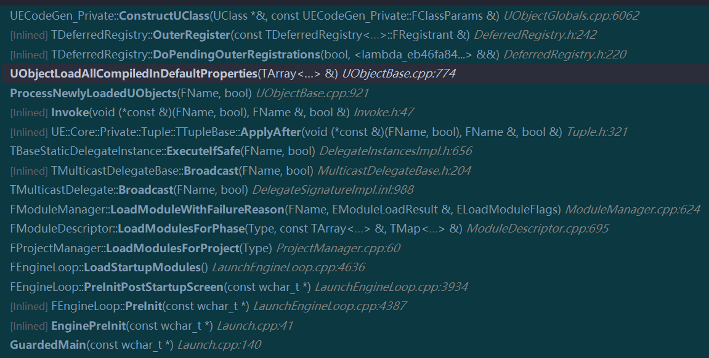
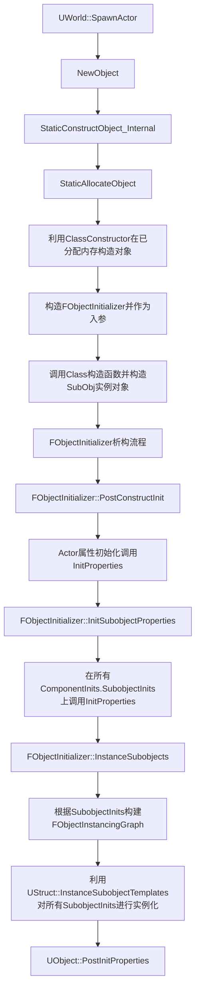
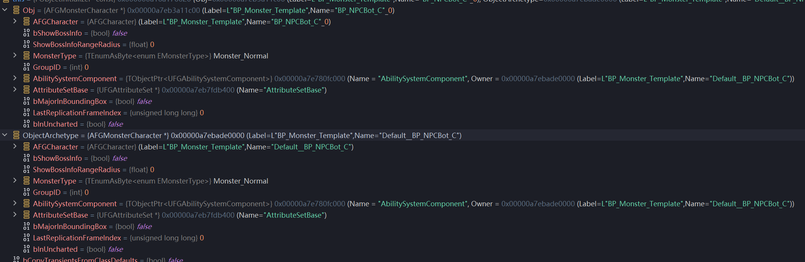
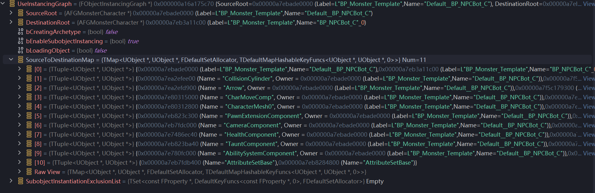
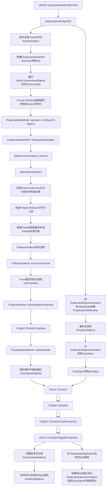
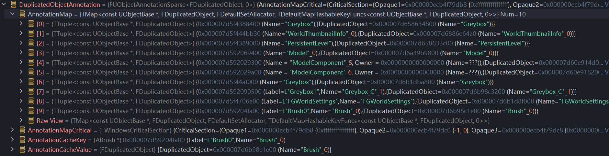

# UE反射与序列化

## UClass从何而来

### 创建UClass堆栈



### LoadModule触发创建UClass

UE的核心做法是利用static变量来进行自动注册，从而在对应模块Load时自动将需要创建的UClass注册到全局变量中。
构建UClass中比较重要的结果就是FClassRegisterCompiledInInfo，里面包含InnerRegister和OuterRegister两个函数。

```cpp
// FGPawn.gen.cpp
struct Z_CompiledInDeferFile_FID_FortuneGame_Source_FortuneGame_Character_FGPawn_h_Statics
{
    static const FClassRegisterCompiledInInfo ClassInfo[];
};
const FClassRegisterCompiledInInfo Z_CompiledInDeferFile_FID_FortuneGame_Source_FortuneGame_Character_FGPawn_h_Statics::ClassInfo[] = {
    { Z_Construct_UClass_AFGPawn, AFGPawn::StaticClass, TEXT("AFGPawn"), &Z_Registration_Info_UClass_AFGPawn, CONSTRUCT_RELOAD_VERSION_INFO(FClassReloadVersionInfo, sizeof(AFGPawn), 461594623U) },
};
static FRegisterCompiledInInfo Z_CompiledInDeferFile_FID_FortuneGame_Source_FortuneGame_Character_FGPawn_h_1032201821(TEXT("/Script/FortuneGame"), // 注册信息的逻辑
    Z_CompiledInDeferFile_FID_FortuneGame_Source_FortuneGame_Character_FGPawn_h_Statics::ClassInfo, UE_ARRAY_COUNT(Z_CompiledInDeferFile_FID_FortuneGame_Source_FortuneGame_Character_FGPawn_h_Statics::ClassInfo),
    nullptr, 0,
    nullptr, 0);

// UE Source Code
struct FClassRegisterCompiledInInfo
{
	class UClass* (*OuterRegister)();
	class UClass* (*InnerRegister)();
	const TCHAR* Name;
	FClassRegistrationInfo* Info;
	FClassReloadVersionInfo VersionInfo;
};

struct FRegisterCompiledInInfo
{
	template <typename ... Args>
	FRegisterCompiledInInfo(Args&& ... args)
	{
		RegisterCompiledInInfo(std::forward<Args>(args)...);
	}
};

// Multiple registrations
void RegisterCompiledInInfo(const TCHAR* PackageName, const FClassRegisterCompiledInInfo* ClassInfo, size_t NumClassInfo, const FStructRegisterCompiledInInfo* StructInfo, size_t NumStructInfo, const FEnumRegisterCompiledInInfo* EnumInfo, size_t NumEnumInfo)
{
	LLM_SCOPE(ELLMTag::UObject);

	for (size_t Index = 0; Index < NumClassInfo; ++Index)
	{
		const FClassRegisterCompiledInInfo& Info = ClassInfo[Index];
		RegisterCompiledInInfo(Info.OuterRegister, Info.InnerRegister, PackageName, Info.Name, *Info.Info, Info.VersionInfo);
	}
}

void RegisterCompiledInInfo(class UClass* (*InOuterRegister)(), class UClass* (*InInnerRegister)(), const TCHAR* InPackageName, const TCHAR* InName, FClassRegistrationInfo& InInfo, const FClassReloadVersionInfo& InVersionInfo)
{
	check(InOuterRegister);
	check(InInnerRegister);
	FClassDeferredRegistry::AddResult result = FClassDeferredRegistry::Get().AddRegistration(InOuterRegister, InInnerRegister, InPackageName, InName, InInfo, InVersionInfo);

	FString NoPrefix(UObjectBase::RemoveClassPrefix(InName));
	NotifyRegistrationEvent(InPackageName, *NoPrefix, ENotifyRegistrationType::NRT_Class, ENotifyRegistrationPhase::NRP_Added, (UObject * (*)())(InOuterRegister), false);
	NotifyRegistrationEvent(InPackageName, *(FString(DEFAULT_OBJECT_PREFIX) + NoPrefix), ENotifyRegistrationType::NRT_ClassCDO, ENotifyRegistrationPhase::NRP_Added, (UObject * (*)())(InOuterRegister), false);
}
```

`class UClass* (*InnerRegister)();`的定义和实现，主要负责实例化出UClass类并赋予flag，configname等信息

```cpp
// FGPawn.gen.cpp
DECLARE_CLASS(AFGPawn, AModularPawn, COMPILED_IN_FLAGS(0 | CLASS_Config), CASTCLASS_None, TEXT("/Script/FortuneGame"), NO_API) // InnerRegister
IMPLEMENT_CLASS_NO_AUTO_REGISTRATION(AFGPawn);

// UE Source Code
#define DECLARE_CLASS( TClass, TSuperClass, TStaticFlags, TStaticCastFlags, TPackage, TRequiredAPI  ) \
	/** Typedef for the base class ({{ typedef-type }}) */ \
	typedef TSuperClass Super;\
	/** Typedef for {{ typedef-type }}. */ \
	typedef TClass ThisClass;\
	/** Returns a UClass object representing this class at runtime */ \
	inline static UClass* StaticClass() \
	{ \
		return GetPrivateStaticClass(); \
	} \

#define IMPLEMENT_CLASS_NO_AUTO_REGISTRATION(TClass) \
	FClassRegistrationInfo Z_Registration_Info_UClass_##TClass; \
	UClass* TClass::GetPrivateStaticClass() \
	{ \
		if (!Z_Registration_Info_UClass_##TClass.InnerSingleton) \
		{ \
			/* this could be handled with templates, but we want it external to avoid code bloat */ \
			GetPrivateStaticClassBody( \
				StaticPackage(), \
				(TCHAR*)TEXT(#TClass) + 1 + ((StaticClassFlags & CLASS_Deprecated) ? 11 : 0), \
				Z_Registration_Info_UClass_##TClass.InnerSingleton, \
				StaticRegisterNatives##TClass, \
				sizeof(TClass), \
				alignof(TClass), \
				TClass::StaticClassFlags, \
				TClass::StaticClassCastFlags(), \
				TClass::StaticConfigName(), \
				(UClass::ClassConstructorType)InternalConstructor<TClass>, \
				(UClass::ClassVTableHelperCtorCallerType)InternalVTableHelperCtorCaller<TClass>, \
				UOBJECT_CPPCLASS_STATICFUNCTIONS_FORCLASS(TClass), \
				&TClass::Super::StaticClass, \
				&TClass::WithinClass::StaticClass \
			); \
		} \
		return Z_Registration_Info_UClass_##TClass.InnerSingleton; \
	}
```

`class UClass* (*OuterRegister)();`的定义和实现，主要负责注册类内成员和成员函数的信息

```cpp
// FGPawn.gen.cpp
UClass* Z_Construct_UClass_AFGPawn() // OuterRegister
{
    if (!Z_Registration_Info_UClass_AFGPawn.OuterSingleton)
    {
        UECodeGen_Private::ConstructUClass(Z_Registration_Info_UClass_AFGPawn.OuterSingleton, Z_Construct_UClass_AFGPawn_Statics::ClassParams);
    }
    return Z_Registration_Info_UClass_AFGPawn.OuterSingleton;
}

const UECodeGen_Private::FClassParams Z_Construct_UClass_AFGPawn_Statics::ClassParams = {
    &AFGPawn::StaticClass,
    "Game",
    &StaticCppClassTypeInfo,
    DependentSingletons,
    nullptr,
    nullptr,
    nullptr,
    UE_ARRAY_COUNT(DependentSingletons),
    0,
    0,
    0,
    0x009000A4u,
    METADATA_PARAMS(Z_Construct_UClass_AFGPawn_Statics::Class_MetaDataParams, UE_ARRAY_COUNT(Z_Construct_UClass_AFGPawn_Statics::Class_MetaDataParams))
};

// UE Source Code
struct FClassParams
{
    UClass*                                   (*ClassNoRegisterFunc)();
    const char*                                 ClassConfigNameUTF8;
    const FCppClassTypeInfoStatic*              CppClassInfo;
    UObject*                           (*const *DependencySingletonFuncArray)();
    const FClassFunctionLinkInfo*               FunctionLinkArray;
    const FPropertyParamsBase* const*           PropertyArray;
    const FImplementedInterfaceParams*          ImplementedInterfaceArray;
    int32                                       NumDependencySingletons;
    int32                                       NumFunctions;
    int32                                       NumProperties;
    int32                                       NumImplementedInterfaces;
    uint32                                      ClassFlags; // EClassFlags
#if WITH_METADATA
    const FMetaDataPairParam*                   MetaDataArray;
    int32                                       NumMetaData;
#endif
};
```

## SpawnActor属性初始化流程



上述流程中的一些关键点：

- StaticAllocateObject会根据Class分配内存，并为UObject SetFlags等操作

- 构造FObjectInitializer并作为入参，然后构造SubObj实例对象，并将SubObj实例对象与对应的Archetype成对的存储在ComponentInits中

```cpp
AFGMonsterCharacter::AFGMonsterCharacter(const FObjectInitializer& ObjectInitializer)
	: Super(ObjectInitializer)
{
	AbilitySystemComponent = ObjectInitializer.CreateDefaultSubobject<UFGAbilitySystemComponent>(this, TEXT("AbilitySystemComponent"));
	AbilitySystemComponent->SetIsReplicated(true);
	AbilitySystemComponent->SetReplicationMode(EGameplayEffectReplicationMode::Mixed);

	AttributeSetBase = CreateDefaultSubobject<UFGAttributeSet>(TEXT("AttributeSetBase"));

	bMajorInBoundingBox = false;

	ShowBossInfoRangeRadius = 0;
	SetCallPreReplication(true);
}

UObject* FObjectInitializer::CreateDefaultSubobject(UObject* Outer, FName SubobjectFName, const UClass* ReturnType, const UClass* ClassToCreateByDefault, bool bIsRequired, bool bIsTransient) const
{
	UObject* Result = nullptr;
	FOverrides::FOverrideDetails ComponentOverride = SubobjectOverrides.Get(SubobjectFName, ReturnType, ClassToCreateByDefault, !bIsRequired);
	const UClass* OverrideClass = ComponentOverride.Class;
	if (OverrideClass)
	{
		if (OverrideClass->HasAnyClassFlags(CLASS_Abstract))
		{
		}
		else
		{
			UObject* Template = OverrideClass->GetDefaultObject(); // force the CDO to be created if it hasn't already
			EObjectFlags SubobjectFlags = Outer->GetMaskedFlags(RF_PropagateToSubObjects) | RF_DefaultSubObject;

			FStaticConstructObjectParameters Params(OverrideClass);
			Params.Outer = Outer;
			Params.Name = SubobjectFName;
			Params.SetFlags = SubobjectFlags;
			Params.SubobjectOverrides = ComponentOverride.SubOverrides;

			// If the object creating a subobject is being created from a template, not a CDO 
			// then we need to use the subobject from that template as the new subobject's template
			if (!bIsTransient && bOwnerTemplateIsNotCDO)
			{
				UObject* MaybeTemplate = ObjectArchetype->GetDefaultSubobjectByName(SubobjectFName);
				if (MaybeTemplate && Template != MaybeTemplate && MaybeTemplate->IsA(ReturnType))
				{
					Params.Template = MaybeTemplate;
				}
			}

			Result = StaticConstructObject_Internal(Params);

			if (Params.Template)
			{
				ComponentInits.Add(Result, Params.Template);
			}
			else if (!bIsTransient && Outer->GetArchetype()->IsInBlueprint())
			{
				UObject* MaybeTemplate = Result->GetArchetype();
				if (MaybeTemplate && Template != MaybeTemplate && MaybeTemplate->IsA(ReturnType))
				{
					ComponentInits.Add(Result, MaybeTemplate);
				}
			}
		}
	}
	return Result;
}
```

- PostConstructInit流程中，在Actor属性初始化调用InitProperties，会导致满足条件的属性都被使用CDO初始化



- InstanceSubobjects流程中，会依次调用InstancePropertyValue从SourceToDestinationMap获得原来创建好的SubObj实例对象，然后将指针替换回实例对象



```cpp
void FObjectInitializer::InstanceSubobjects(UClass* Class, bool bNeedInstancing, bool bNeedSubobjectInstancing) const
{
	SCOPE_CYCLE_COUNTER(STAT_InstanceSubobjects);

	FObjectInstancingGraph TempInstancingGraph;
	FObjectInstancingGraph* UseInstancingGraph = InstanceGraph ? InstanceGraph : &TempInstancingGraph;
	{
		UseInstancingGraph->AddNewObject(Obj, ObjectArchetype);
	}
	// Add any default subobjects
	for (const FSubobjectsToInit::FSubobjectInit& SubobjectInit : ComponentInits.SubobjectInits)
	{
		UseInstancingGraph->AddNewObject(SubobjectInit.Subobject, SubobjectInit.Template);
	}
	if (bNeedInstancing)
	{
		UObject* Archetype = ObjectArchetype ? ObjectArchetype : Obj->GetArchetype();
		Class->InstanceSubobjectTemplates(Obj, Archetype, Archetype ? Archetype->GetClass() : NULL, Obj, UseInstancingGraph);
	}
	if (bNeedSubobjectInstancing)
	{
		// initialize any subobjects, now that the constructors have run
		for (int32 Index = 0; Index < ComponentInits.SubobjectInits.Num(); Index++)
		{
			UObject* Subobject = ComponentInits.SubobjectInits[Index].Subobject;
			UObject* Template = ComponentInits.SubobjectInits[Index].Template;

#if USE_CIRCULAR_DEPENDENCY_LOAD_DEFERRING
			if ( !Subobject->HasAnyFlags(RF_NeedLoad) || bIsDeferredInitializer )
#else 
			if ( !Subobject->HasAnyFlags(RF_NeedLoad) )
#endif
			{
				Subobject->GetClass()->InstanceSubobjectTemplates(Subobject, Template, Template->GetClass(), Subobject, UseInstancingGraph);
			}
		}
	}
}

UObject* FObjectInstancingGraph::GetDestinationObject(UObject* SourceObject)
{
	check(SourceObject);
	return SourceToDestinationMap.FindRef(SourceObject);
}

UObject* FObjectInstancingGraph::GetInstancedSubobject( UObject* SourceSubobject, UObject* CurrentValue, UObject* CurrentObject, EInstancePropertyValueFlags Flags )
{
	UObject* InstancedSubobject = INVALID_OBJECT;

	if ( SourceSubobject != nullptr && CurrentValue != nullptr && !CurrentValue->IsIn(CurrentObject))
	{
		if ( bShouldInstance )
		{
			// search for the unique subobject instance that corresponds to this subobject template
			InstancedSubobject = GetDestinationObject(SourceSubobject);
			if ( InstancedSubobject == nullptr )
			{
					const bool bIsRuntimeInstance = CurrentValue != SourceSubobject && CurrentValue->GetOuter() == CurrentObject;
					if (bIsRuntimeInstance )
					{
						InstancedSubobject = CurrentValue; 
					}
					else
					{
						if ( ((GIsClient && bShouldLoadForClient) || (GIsServer && bShouldLoadForServer) || bShouldLoadForEditor) )
						{
							if (!InstancedSubobject)
							{
								// finally, create the subobject instance
								FStaticConstructObjectParameters Params(SourceSubobject->GetClass());
								Params.Outer = SubobjectOuter;
								Params.Name = SubobjectName;
								Params.SetFlags = SubobjectOuter->GetMaskedFlags(RF_PropagateToSubObjects);
								Params.Template = SourceSubobject;
								Params.bCopyTransientsFromClassDefaults = true;
								Params.InstanceGraph = this;
								InstancedSubobject = StaticConstructObject_Internal(Params);
							}
						}
					}
			}
		}
	}

	return InstancedSubobject;
}
```

## Actor放入World初始化流程



上述流程中的一些关键点：

- StaticDuplicateObjectEx时的特殊处理

```cpp
UObject* StaticDuplicateObjectEx( FObjectDuplicationParameters& Parameters )
{
	FObjectInstancingGraph InstanceGraph;
	// disable object and component instancing while we're duplicating objects, as we're going to instance components manually a little further below
	InstanceGraph.EnableSubobjectInstancing(false);

	// we set this flag so that the component instancing code doesn't think we're creating a new archetype, because when creating a new archetype,
	// the ObjectArchetype for instanced components is set to the ObjectArchetype of the source component, which in the case of duplication (or loading)
	// will be changing the archetype's ObjectArchetype to the wrong object (typically the CDO or something)
	InstanceGraph.SetLoadingObject(true);

	// Read from the source object(s)
	FDuplicateDataWriter Writer(
		DuplicatedObjectAnnotation,				// Ref: Object annotation which stores the duplicated object for each source object
		ObjectData.Get(),						// Out: Serialized object data
		Parameters.SourceObject,				// Source object to copy
		DupRootObject,							// Destination object to copy into
		Parameters.FlagMask,					// Flags to be copied for duplicated objects
		Parameters.ApplyFlags,					// Flags to always set on duplicated objects
		Parameters.InternalFlagMask,			// Internal Flags to be copied for duplicated objects
		Parameters.ApplyInternalFlags,			// Internal Flags to always set on duplicated objects
		&InstanceGraph,							// Instancing graph
		Parameters.PortFlags,					// PortFlags	
		Parameters.bAssignExternalPackages);	// Assign duplicate external packages

	TArray<UObject*> SerializedObjects;

    InstanceGraph.SetDestinationRoot( DupRootObject );
	while(Writer.UnserializedObjects.Num())
	{
		UObject*	Object = Writer.UnserializedObjects.Pop();
		Object->Serialize(Writer);
		SerializedObjects.Add(Object);
	};

    FDuplicateDataReader Reader(DuplicatedObjectAnnotation, ObjectData.Get(), Parameters.PortFlags, Parameters.DestOuter);
	Reader.SetSerializeContext(LoadContext);
	for(int32 ObjectIndex = 0;ObjectIndex < SerializedObjects.Num();ObjectIndex++)
	{
		UObject* SerializedObject = SerializedObjects[ObjectIndex];

		FDuplicatedObject ObjectInfo = DuplicatedObjectAnnotation.GetAnnotation( SerializedObject );
		checkSlow( !ObjectInfo.IsDefault() );

		UObject* DuplicatedObject = ObjectInfo.DuplicatedObject.GetEvenIfUnreachable();
		check(DuplicatedObject);

		TGuardValue<UObject*> SerializedObjectGuard(LoadContext->SerializedObject, DuplicatedObject);
		if ( !SerializedObject->HasAnyFlags(RF_ClassDefaultObject) )
		{
			DuplicatedObject->Serialize(Reader);
		}
		else
		{
			// if the source object was a CDO, then transient property values were serialized by the FDuplicateDataWriter
			// and in order to read those properties out correctly, we'll need to enable defaults serialization on the
			// reader as well.
			Reader.StartSerializingDefaults();
			DuplicatedObject->Serialize(Reader);
			Reader.StopSerializingDefaults();
		}
	}
}
```

- GetDuplicatedObject负责查询是否已有对象被复制，如果没有则创建新对象，并将SourceObject和DupObject成对存储在DuplicatedObjectAnnotation中，将SourceObject记录在UnserializedObjects

```cpp
UObject* FDuplicateDataWriter::GetDuplicatedObject(UObject* Object, bool bCreateIfMissing)
{
	UObject* Result = nullptr;
	if (IsValid(Object))
	{
		// Check for an existing duplicate of the object.
		FDuplicatedObject DupObjectInfo = DuplicatedObjectAnnotation.GetAnnotation( Object );
		if( !DupObjectInfo.IsDefault() )
		{
			Result = DupObjectInfo.DuplicatedObject.GetEvenIfUnreachable();
		}
		else if (bCreateIfMissing)
		{
			// Check to see if the object's outer is being duplicated.
			UObject* DupOuter = GetDuplicatedObject(Object->GetOuter());
			if(DupOuter != nullptr)
			{
				// The object's outer is being duplicated, create a duplicate of this object.
				FStaticConstructObjectParameters Params(Object->GetClass());
				Params.Outer = DupOuter;
				Params.Name = Object->GetFName();
				Params.SetFlags = ApplyFlags | Object->GetMaskedFlags(FlagMask);
				Params.InternalSetFlags = ApplyInternalFlags | (Object->GetInternalFlags() & InternalFlagMask);
				Params.Template = Object->GetArchetype();
				Params.bCopyTransientsFromClassDefaults = true;
				Params.InstanceGraph = InstanceGraph;
				Result = StaticConstructObject_Internal(Params);
				
				// If we assign external package to duplicated object, fetch the package
				Result->SetExternalPackage(bAssignExternalPackages ? Cast<UPackage>(GetDuplicatedObject(Object->GetExternalPackage(), false)) : nullptr);
				
				AddDuplicate(Object, Result);
			}
		}
	}

	return Result;
}

void FDuplicateDataWriter::AddDuplicate(UObject* SourceObject, UObject* DupObject)
{
	if ( DupObject && !DupObject->IsTemplate() )
	{
		// Make sure the duplicated object is prepared to postload
		DupObject->SetFlags(RF_NeedPostLoad|RF_NeedPostLoadSubobjects);
	}

	// Check for an existing duplicate of the object; if found, use that one instead of creating a new one.
	FDuplicatedObject Info = DuplicatedObjectAnnotation.GetAnnotation( SourceObject );
	if ( Info.IsDefault() )
	{
		DuplicatedObjectAnnotation.AddAnnotation( SourceObject, FDuplicatedObject( DupObject ) );
	}
	else
	{
		Info.DuplicatedObject = DupObject;
	}


	UnserializedObjects.Add(SourceObject);
}
```



- FDuplicateDataReader反序列化Obj属性流程

```cpp
FArchive& FDuplicateDataReader::operator<<( UObject*& Object )
{
	UObject*	SourceObject = Object;
	Serialize(&SourceObject,sizeof(UObject*));

	FDuplicatedObject ObjectInfo = SourceObject ? DuplicatedObjectAnnotation.GetAnnotation(SourceObject) : FDuplicatedObject();
	if( !ObjectInfo.IsDefault() )
	{
		Object = ObjectInfo.DuplicatedObject.GetEvenIfUnreachable();
	}
	else
	{
		Object = SourceObject;
	}

	return *this;
}
```

## 疑问解开

### 为什么默认组件和子对象都要加DefaultToInstanced

- UHT对DefaultToInstanced标记的Object属性进行特殊标记

```cs
	public class UhtObjectProperty : UhtObjectPropertyBase
	{
		protected override bool ResolveSelf(UhtResolvePhase phase)
		{
			bool results = base.ResolveSelf(phase);
			switch (phase)
			{
				case UhtResolvePhase.Final:
					if (Class.HierarchyHasAnyClassFlags(EClassFlags.DefaultToInstanced))
					{
						PropertyFlags |= EPropertyFlags.InstancedReference;
						MetaData.Add(UhtNames.EditInline, true);
					}
					break;
			}
			return results;
		}
	}
```

- 以MonsterCharacter中的AttributeSetBase为例，EPropertyFlags为CPF_Edit | CPF_ExportObject | CPF_DisableEditOnInstance | CPF_InstancedReference | CPF_NativeAccessSpecifierPrivate，并且ClassFlags也会被特殊标记CLASS_Config | CLASS_MatchedSerializers | CLASS_Native | CLASS_RequiredAPI | CLASS_HasInstancedReference

```cpp
const UECodeGen_Private::FObjectPropertyParams Z_Construct_UClass_AFGMonsterCharacter_Statics::NewProp_AttributeSetBase = { "AttributeSetBase", nullptr, (EPropertyFlags)0x0040000000090009, UECodeGen_Private::EPropertyGenFlags::Object, RF_Public|RF_Transient|RF_MarkAsNative, nullptr, nullptr, 1, STRUCT_OFFSET(AFGMonsterCharacter, AttributeSetBase), Z_Construct_UClass_UFGAttributeSet_NoRegister, METADATA_PARAMS(UE_ARRAY_COUNT(NewProp_AttributeSetBase_MetaData), NewProp_AttributeSetBase_MetaData) };

const UECodeGen_Private::FPropertyParamsBase* const Z_Construct_UClass_AFGMonsterCharacter_Statics::PropPointers[] = {
	(const UECodeGen_Private::FPropertyParamsBase*)&Z_Construct_UClass_AFGMonsterCharacter_Statics::NewProp_bShowBossInfo,
	(const UECodeGen_Private::FPropertyParamsBase*)&Z_Construct_UClass_AFGMonsterCharacter_Statics::NewProp_ShowBossInfoRangeRadius,
	(const UECodeGen_Private::FPropertyParamsBase*)&Z_Construct_UClass_AFGMonsterCharacter_Statics::NewProp_MonsterType,
	(const UECodeGen_Private::FPropertyParamsBase*)&Z_Construct_UClass_AFGMonsterCharacter_Statics::NewProp_GroupID,
	(const UECodeGen_Private::FPropertyParamsBase*)&Z_Construct_UClass_AFGMonsterCharacter_Statics::NewProp_AbilitySystemComponent,
	(const UECodeGen_Private::FPropertyParamsBase*)&Z_Construct_UClass_AFGMonsterCharacter_Statics::NewProp_AttributeSetBase,
	(const UECodeGen_Private::FPropertyParamsBase*)&Z_Construct_UClass_AFGMonsterCharacter_Statics::NewProp_bInUncharted,
};

const UECodeGen_Private::FClassParams Z_Construct_UClass_AFGMonsterCharacter_Statics::ClassParams = {
	&AFGMonsterCharacter::StaticClass,
	"Game",
	&StaticCppClassTypeInfo,
	DependentSingletons,
	FuncInfo,
	Z_Construct_UClass_AFGMonsterCharacter_Statics::PropPointers,
	nullptr,
	UE_ARRAY_COUNT(DependentSingletons),
	UE_ARRAY_COUNT(FuncInfo),
	UE_ARRAY_COUNT(Z_Construct_UClass_AFGMonsterCharacter_Statics::PropPointers),
	0,
	0x009000A4u,
	METADATA_PARAMS(UE_ARRAY_COUNT(Z_Construct_UClass_AFGMonsterCharacter_Statics::Class_MetaDataParams), Z_Construct_UClass_AFGMonsterCharacter_Statics::Class_MetaDataParams)
};
```
