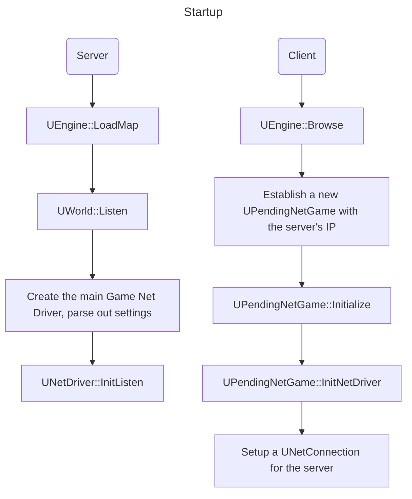
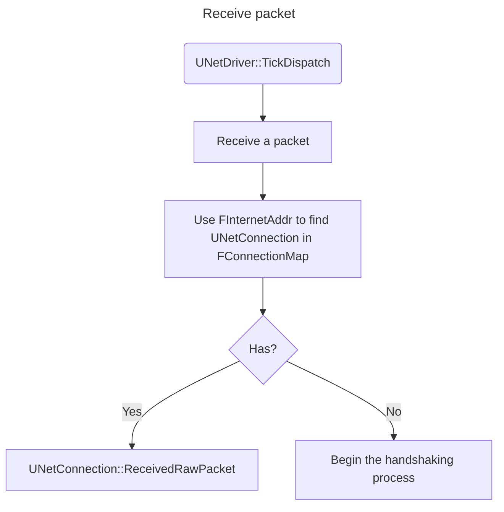
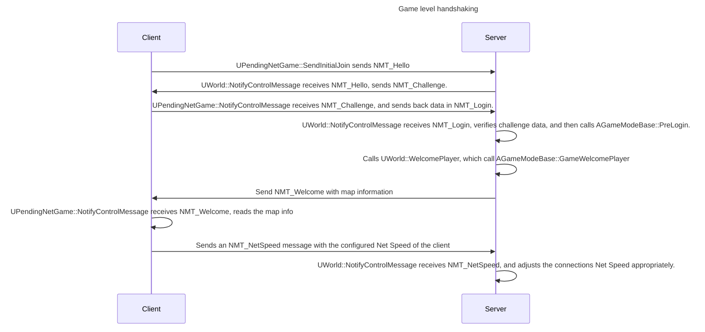
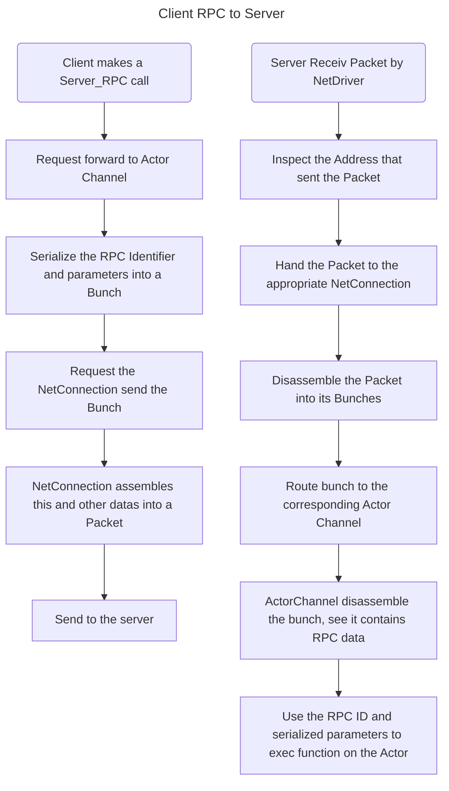
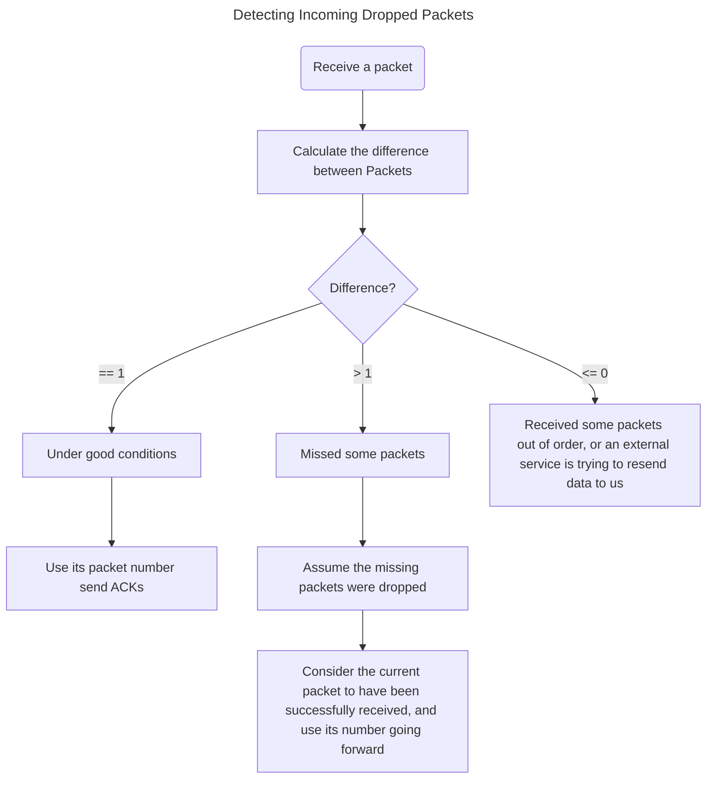
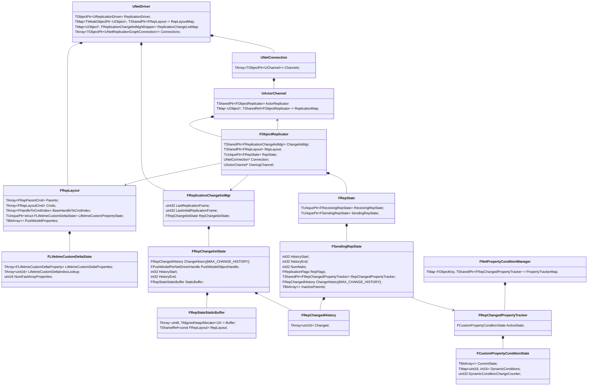
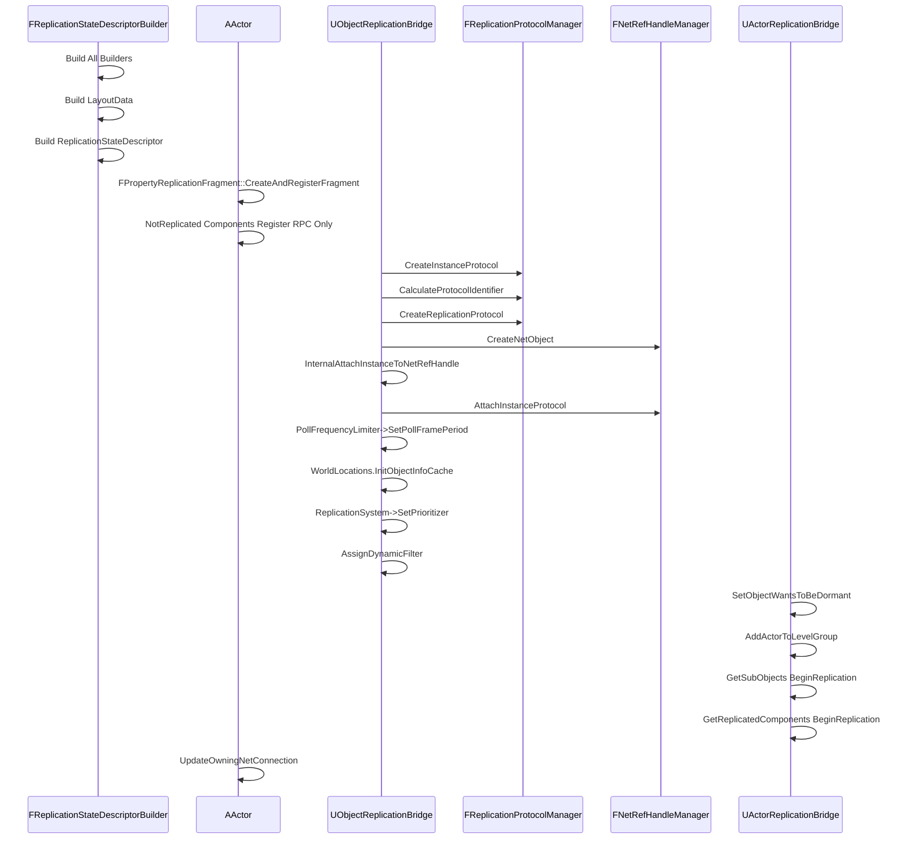

# UE 网络同步

## NetDrivers, NetConnections, and Channels

- UNetDrivers 负责管理 UNetConnections 以及可在它们之间共享的数据，网络同步的发起点可以说就是 UNetDriver。
- NetConnections 代表连接到游戏（或更广泛地说，连接到 NetDriver）的单个客户端。
- 最终的数据不直接由 NetConnections 处理。相反，NetConnections 会将数据路由至 Channels。每个 NetConnection 都有自己的 Channels。
- 要同步的Actor都会创建对应的 UActorChannel，因此一个 Actor 如果要在所有 NetConnections 同步，那么每个 NetConnection 都会为其创建一个 UActorChannel。
- 在正常情况下，只有一个 NetDriver（在客户端和服务器都会创建）用于"标准"游戏流量和连接。
- UIpNetDriver 和 UIpConnection（或派生类）是几乎所有平台的引擎默认使用的方式。
- 服务器和客户端都拥有自己的 NetDriver，UE 所有的游戏流量都将由 IpNetDriver 发送或接收。

## Startup and Handshaking





## UWorld / UPendingNetGame / AGameModeBase Startup and Handshaking

- 在 UNetDriver 和 UNetConnection 完成客户端和服务器的握手过程后，客户端将调用 UPendingNetGame::SendInitialJoin 启动游戏级的握手流程。
- 此握手流程是通过一套更有条理、更复杂的 FNetControlMessages 完成的。
  - 整套控制信息可在 DataChannel.h 中找到。
- 处理这些控制信息的大部分工作在 UWorld::NotifyControlMessage 和 UPendingNetGame::NotifyControlMessage 中完成。



- 此时，握手已经完成，玩家与游戏完全连接。根据加载地图所需的时间，在控制权转移到 UWorld 之前，客户端仍可能在 UPendingNetGame 上收到一些非握手控制信息。

## Reestablishing Lost Connections

- 如果是服务器主动断开连接，或者服务器意识到连接断开（由于超时或出错），那么将通过关闭 UNetConnection 并通知游戏来处理。
  - 此时，游戏将自行决定是否支持"游戏进行中加入"或"重新加入"。如果游戏支持，将完全重新启动上述握手流程。
- 如果只是短暂中断了客户端的连接，但服务器从未察觉，那么引擎/游戏通常会自动恢复（尽管会有一些数据包丢失/延迟）。
- 但是，如果客户端的 IP 地址或端口因任何原因发生变化，但服务器并未察觉，那么将通过重新进行low level handshake来开始恢复整个过程。在这种情况下，游戏代码不会收到提醒。
- 详细实现在 StatlessConnectionHandlerComponent.cpp 中。

## Data Transmission

- 游戏中的 NetConnections 和 NetDrivers 通常与所使用的底层通信方法/技术无关。这是由子类来决定的（如 UIpConnection / UIpNetDriver 或 UWebSocketConnection / UWebSocketNetDriver）。
  - 相反，UNetDriver 和 UNetConnection 使用 Packets 和 Bunches。
- Packets 是在主机和客户端上成对的 NetConnections 之间发送的数据块。Packets 由元数据（如报头信息和确认信息）和 Bunches 组成。
- Bunches 是在主机和客户端上成对的 Channels 之间发送的数据块。
  - 当一个连接收到一个 Packet 时，该 Packet 将被分解成单独的 Bunches。然后，这些 Bunches 会被传递到各个 Channels 进一步处理。
- 一个 Packet 可能不包含 Bunches、一个 Bunche 或多个 Bunches。
  - 由于 Bunches 的大小限制可能大于单个 Packet 的大小限制，UE 支持部分分组的概念。
  - 当 Bunche 过大时，会在传输前将其切成若干较小的 Bunches。这些 Bunches 将标记为 PartialInitial、Partial 或 PartialFinal。利用这些信息，我们可以在接收端重新组合 Bunches。



## Reliability and Retransmission

- 当建立 NetConnection 时，其将为它所对应的 Packets 和 Bunches 建立一个序列号。序列号可以是固定的，也可以是随机的（随机时，序列号将由服务器发送）。
- Packet 编号为每个 NetConnection 独立的编号，每发送一个 Packet 就会递增编号，每个 Packet 都会包含其数据包编号，UE绝不会多次发送具有相同编号的 Packet。
- Bunche 编号是按 Channel 计算的，每发送一个**可靠**的 Bunche 编号就会递增一次，每个**可靠**的 Bunche 都会包含其对应的编号。但与 Packet 不同的是，可靠的 Bunche 可以重传。这意味着可能会重新发送具有相同编号的 Bunche。

### Detecting Incoming Dropped Packets

- 通过分配 Packet 编号，我们可以轻松检测接收到的数据包何时丢失。方法很简单，只需计算最后一次成功接收的 Packet 编号与当前正在处理的 Packet 编号之间的差值即可。



- 在上述这两种情况下，引擎通常会忽略丢失或无效的 Packet，也不会发送 ACK。
- UE也确实有办法"修复"在同一帧上接收到的顺序不对的 Packet。
  - 启用后，如果检测到 Packet 丢失（差值 > 1），UE不会立即处理当前数据包。
  - 相反，它会将其添加到一个队列中。下一次成功接收 Packet 时（差值 == 1），将查看队列的头部是否排序正确。如果是，将处理它，否则将继续接收数据包。

### Detecting Outgoing Dropped Packets

- 如上所述，每当成功接收一个 Packet，接收方都会发回一个 ACK。这些 ACK 将按顺序包含成功接收到的 Packet 的编号。
- 在处理 ACK 时，将忽略上次收到的 ACK 之前的任何 ACK，然而 Packet 编号中的任何间隙都会被视为未确认（NAK）。
- 发送方有责任处理这些 ACK 和 NAK，并重新发送任何丢失的数据。
  - 新数据将添加到新发出的 Packet 中（牢记，UE不会重新发送已发送的 Packet，也不会重复使用 Packet 序列号）。

### Resending Missing Data

- 如上所述，Packet 本身并不包含有用的游戏数据。相反，由 Bunche 组成的群组才是有意义的数据。
- Bunche 可以标记为可靠或不可靠。
  - 如果不可靠的 Bunche 被丢弃，引擎将不会尝试重新发送。
  - 但是，引擎会尝试重新发送可靠的 Bunche。每当发送一个可靠的 Bunche 时，它就会被添加到一个 un-ACKed 的可靠 Bunche 列表中。
  - 如果收到包含 Bunche 的 Packet 的 NAK，引擎将重新发送该 Bunche 的副本。
  - 需要注意的是，由于 Bunche 可能是分组发送的，因此即使只丢失了一个部分的 Bunche 也会导致重新传输整个 Bunche。当包含一个 Bunche 的所有 Packet 都被 ACK 后，将把它从列表中删除。
- 与 Packet 类似，UE会将收到的可靠 Bunche 的编号与最后一次成功接收的编号进行比较。如果检测到差值为负，就直接忽略该 Bunche。
  - 如果差值大于 1，就认为漏掉了一个 Bunche。与 Packet 处理不同，不会丢弃这些数据。
  - 相反，UE会将现在起收到 Bunche 统统记录起来，并暂停处理**任何**Bunches，无论是否是可靠的 Bunche。直到检测到成功接收遗漏的 Bunche，才会恢复处理，此时将首先处理这些 Bunche，然后开始处理之前记录的其他 Bunches。

## Class diagrams



## 网络休眠

```mermaid
flowchart TD

   
```

## Iris

### Actor注册

- AActor::BeginReplication
  - UActorReplicationBridge::BeginReplication
    - UObjectReplicationBridge::BeginReplication
      - FObjectReferenceCache::CreateObjectReferenceHandle
        - FNetRefHandleManager::AllocateNetRefHandle
        - FObjectReferenceCache::CreateObjectReferenceHandle On OuterObj
        - `ReferenceHandleToCachedReference.Add(NetRefHandle, CachedObject)`
      - UObjectReplicationBridge::CallRegisterReplicationFragments
        - AActor::RegisterReplicationFragments
          - FReplicationFragmentUtil::CreateAndRegisterFragmentsForObject
            - FReplicationStateDescriptorBuilder::CreateDescriptorsForClass
              - AActor::GetLifetimeReplicatedProps
              - `FPropertyReplicationStateDescriptorBuilder Builders[BuilderTypeCount]`
              - `for (const FRepRecord& RepRecord : InObjectClass->ClassReps)`
                - FPropertyReplicationStateDescriptorBuilder::IsSupportedProperty // Init FMemberProperty and traits
                - FReplicationStateDescriptorBuilder::AddMemberProperty
              - FReplicationStateDescriptorBuilder::AddMemberFunction // Add RPCs
              - Builders.FPropertyReplicationStateDescriptorBuilder::Build // BuildParameters.DescriptorType = ::EDescriptorType::Class
                - FPropertyReplicationStateDescriptorBuilder::BuildMemberCache
                  - FPropertyReplicationStateDescriptorBuilder::GetDescriptorForStructProperty
                    - FReplicationStateDescriptorBuilder::CreateDescriptorForStruct
                      - FPropertyReplicationStateDescriptorBuilder::Build // BuildParameters.DescriptorType = ::EDescriptorType::Struct
                      - FReplicationStateDescriptorRegistry::Register
                - FPropertyReplicationStateDescriptorBuilder::BuildMemberReferenceCache
                - FPropertyReplicationStateDescriptorBuilder::BuildMemberTagCache
                - FPropertyReplicationStateDescriptorBuilder::BuildMemberFunctionCache
                  - FPropertyReplicationStateDescriptorBuilder::GetOrCreateDescriptorForFunction
                    - FReplicationStateDescriptorBuilder::CreateDescriptorForFunction
                      - FPropertyReplicationStateDescriptorBuilder::IsSupportedProperty
                      - FReplicationStateDescriptorBuilder::AddMemberProperty
                      - FPropertyReplicationStateDescriptorBuilder::Build // BuildParameters.DescriptorType = ::EDescriptorType::Function
                      - FReplicationStateDescriptorRegistry::Register
                - FPropertyReplicationStateDescriptorBuilder::BuildReplicationStateTraits
                - New FReplicationStateDescriptor

            - FReplicationStateDescriptorBuilder::Add FMemberProperty to FPropertyReplicationState
  - AActor::UpdateOwningNetConnection



### Actor复制

```mermaid
sequenceDiagram


```

### 类图

```mermaid
classDiagram

class UActorReplicationBridge{
	UNetDriver* NetDriver;
	UIrisObjectReferencePackageMap* ObjectReferencePackageMap;
	uint32 SpawnInfoFlags;
}

class UObjectReplicationBridge{
    UE::Net::Private::FObjectPollFrequencyLimiter* PollFrequencyLimiter;
    TMap~FName, FClassFilterInfo~ ClassesWithDynamicFilter;
}

class FObjectPollFrequencyLimiter{
	uint8 FrameIndexOffsets[256];
	TArray~uint8~ FramesBetweenUpdates;
	TArray~uint8~ FrameCounters;
}

class UReplicationBridge{
	UReplicationSystem* ReplicationSystem;
	UE::Net::Private::FReplicationProtocolManager* ReplicationProtocolManager;
	UE::Net::Private::FReplicationStateDescriptorRegistry* ReplicationStateDescriptorRegistry;
	UE::Net::Private::FNetRefHandleManager* NetRefHandleManager;
	UE::Net::Private::FObjectReferenceCache* ObjectReferenceCache;
	UE::Net::Private::FNetObjectGroups* Groups;
}

class FReplicationProtocolManager{
    TMultiMap~FReplicationProtocolIdentifier, FRegisteredProtocolInfo~ RegisteredProtocols;
	TMap~const FReplicationProtocol*, FRegisteredProtocolInfo~ ProtocolToInfoMap;
	
	TMultiMap~const FReplicationStateDescriptor*, const FReplicationProtocol*~ DescriptorToProtocolMap;
	TArray~const FReplicationProtocol*~ PendingDestroyProtocols;
}

class FRegisteredProtocolInfo{
    const FReplicationProtocol* Protocol;
    const UObject* ArchetypeOrCDOUsedAsKey;
}

class FReplicationProtocol{
	const FReplicationStateDescriptor** ReplicationStateDescriptors;
	uint32 ReplicationStateCount;
}

class FReplicationStateDescriptorRegistry{
    typedef TMap~FFieldVariant, FRegisteredDescriptors~ FClassToDescriptorMap;
	FClassToDescriptorMap RegisteredDescriptorsMap;
	FReplicationProtocolManager* ProtocolManager;
}

class FRegisteredDescriptors{
    TWeakObjectPtr~const UObject~ WeakPtrForPruning;

    typedef TArray~TRefCountPtr~const FReplicationStateDescriptor~~ FDescriptors;
    FDescriptors Descriptors;
}

class FReplicationStateDescriptor{
	uint16 MemberCount;
	uint16 FunctionCount;
}

class FObjectReferenceCache{
    TMap~const UObject*, FNetRefHandle~ ObjectToNetReferenceHandle;
    TMap~FNetRefHandle, FCachedNetObjectReference~ ReferenceHandleToCachedReference;

    UReplicationSystem* ReplicationSystem;
	UObjectReplicationBridge* ReplicationBridge;
	FNetTokenStore* NetTokenStore;
	FStringTokenStore* StringTokenStore;
	FNetRefHandleManager* NetRefHandleManager;
}

class FNetRefHandleManager{
    FRefHandleMap RefHandleToInternalIndex;
	FNetHandleMap NetHandleToInternalIndex;
    TNetChunkedArray~FReplicatedObjectData~ ReplicatedObjectData;
	TNetChunkedArray~uint8*~ ReplicatedObjectStateBuffers;
	TNetChunkedArray~uint16~ ReplicatedObjectRefCount;
    TNetChunkedArray~TObjectPtr~UObject~~ ReplicatedInstances;
	uint64 NextStaticHandleIndex;
	uint64 NextDynamicHandleIndex;
}

class FReplicatedObjectData{
    FNetRefHandle RefHandle;
    FNetHandle NetHandle;
    const FReplicationProtocol* Protocol;
    const FReplicationInstanceProtocol* InstanceProtocol;
    uint8* ReceiveStateBuffer;
    FInternalNetRefIndex SubObjectRootIndex;
    FInternalNetRefIndex SubObjectParentIndex;
}

class FCachedNetObjectReference{
    TWeakObjectPtr~UObject~ Object;
    const UObject* ObjectKey = nullptr;
    FNetRefHandle NetRefHandle;
    FNetToken RelativePath;
    FNetRefHandle OuterNetRefHandle;
    uint8 bNoLoad : 1;
    uint8 bIgnoreWhenMissing : 1;
    uint8 bIsPackage : 1;
    uint8 bIsBroken : 1;
    uint8 bIsPending : 1;
}

class FReplicationFragment{
    EReplicationFragmentTraits Traits;
}

class UReplicationSystem{
    TPimplPtr~UE::Net::Private::FReplicationSystemImpl~ Impl;
    TObjectPtr~UReplicationBridge~ ReplicationBridge;
}

class FReplicationSystemImpl{
    TMap~FObjectKey, ENetObjectAttachmentSendPolicyFlags~ AttachmentSendPolicyFlags;
	UReplicationSystem* ReplicationSystem;
	FReplicationSystemInternal ReplicationSystemInternal;
}

class FReplicationSystemInternal{
    FReplicationProtocolManager ReplicationProtocolManager;
	FNetRefHandleManager NetRefHandleManager;
	FReplicationSystemInternalInitParams InternalInitParams;
	FDirtyNetObjectTracker DirtyNetObjectTracker;
	FReplicationStateStorage ReplicationStateStorage;
	FReplicationStateDescriptorRegistry ReplicationStateDescriptorRegistry;
	UReplicationBridge* ReplicationBridge;
	UIrisObjectReferencePackageMap* IrisObjectReferencePackageMap;
	FChangeMaskCache ChangeMaskCache;
	FReplicationConnections Connections;
	FReplicationFiltering Filtering;
	FNetObjectGroups Groups;
	FReplicationConditionals Conditionals;
	FReplicationPrioritization Prioritization;
	FObjectReferenceCache ObjectReferenceCache;
	FNetBlobManager NetBlobManager;
	FNetTokenStore NetTokenStore;
	FStringTokenStore StringTokenStore;
	FNetCullDistanceOverrides NetCullDistanceOverrides;
	FWorldLocations WorldLocations;
	FDeltaCompressionBaselineManager DeltaCompressionBaselineManager;
	FNetSendStats SendStats;
	FNetTypeStats TypeStats;
	FForwardNetRPCCallMulticastDelegate ForwardNetRPCCallMulticastDelegate;
	uint32 Id;
}

class FReplicationFiltering{
    FReplicationConnections* Connections = nullptr;
    TArray<uint16> ObjectIndexToOwningConnection;
}

class FReplicationConditionals{
	const FNetRefHandleManager* NetRefHandleManager = nullptr;
	const FReplicationFiltering* ReplicationFiltering = nullptr;
	const FReplicationConnections* ReplicationConnections = nullptr;
	const FNetObjectGroups* NetObjectGroups = nullptr;

	TArray~FPerObjectInfo~ PerObjectInfos;
	TArray~FPerConnectionInfo~ ConnectionInfos;
	TMap~FInternalNetRefIndex, FObjectDynamicConditions~ DynamicConditions;
}

UReplicationBridge <|-- UObjectReplicationBridge
UObjectReplicationBridge <|-- UActorReplicationBridge
UObjectReplicationBridge *-- FObjectPollFrequencyLimiter

UReplicationBridge --> FReplicationProtocolManager
UReplicationBridge --> FReplicationStateDescriptorRegistry
UReplicationBridge --> FNetRefHandleManager
UReplicationBridge --> FObjectReferenceCache

FReplicationProtocolManager --> FReplicationProtocol
FReplicationProtocolManager *-- FReplicationStateDescriptor
FReplicationProtocolManager *-- FRegisteredProtocolInfo

FReplicationStateDescriptorRegistry *-- FRegisteredDescriptors
FRegisteredDescriptors *-- FReplicationStateDescriptor

FObjectReferenceCache --> FNetRefHandleManager
FObjectReferenceCache *-- FCachedNetObjectReference

UReplicationSystem *-- FReplicationSystemImpl
FReplicationSystemImpl --> UReplicationSystem
FReplicationSystemImpl *-- FReplicationSystemInternal
UReplicationSystem *-- UReplicationBridge
FReplicationSystemInternal *-- FReplicationProtocolManager
FReplicationSystemInternal *-- FNetRefHandleManager
FReplicationSystemInternal *-- FReplicationStateDescriptorRegistry
FReplicationSystemInternal *-- FObjectReferenceCache

```


